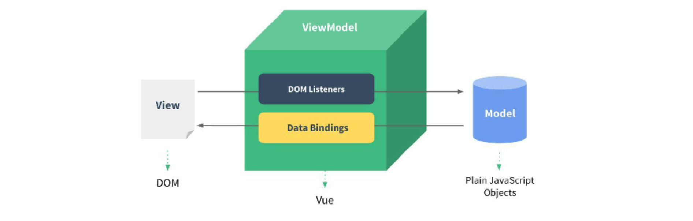
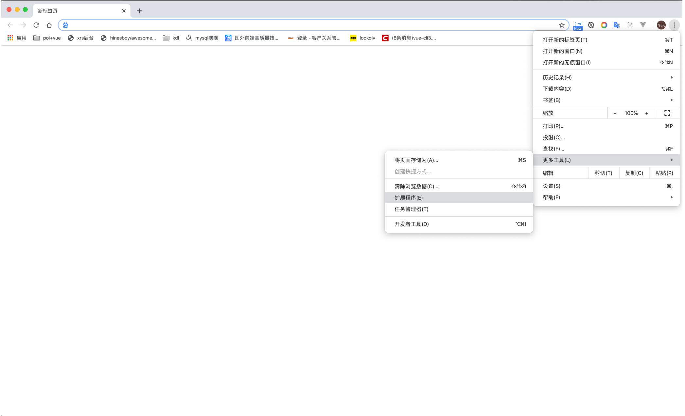
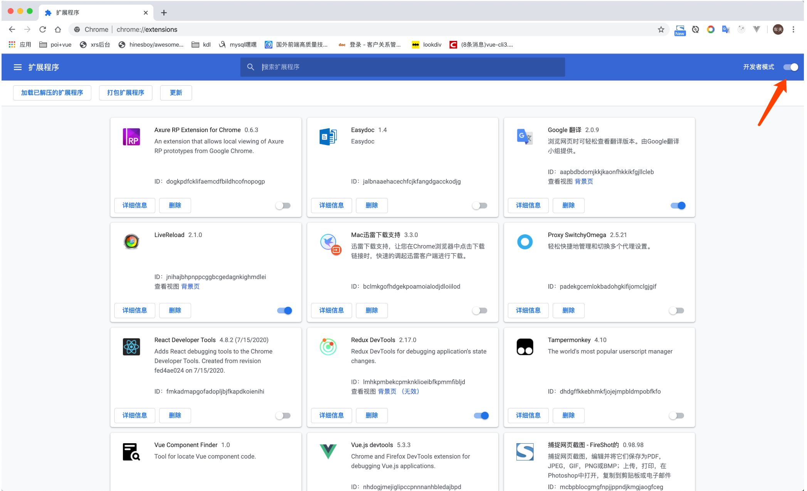

# 叩丁狼-Vue全家桶 第一天

## 学习目标

> 理解框架和库的区别
>
> 理解MVVM
>
> 能够说出Vue框架的特点
>
> 能够写出Vue的插值语法（{{  }}的写法）
>
> 能够写出vue指令及对应作用
>
> 能够写出:value和@input代替v-model的案例

## 一、框架和库的区别

库：提供一些封装好的功能代码。 更换库，相对比较容易切换，修改差异点就可以了。
例如：jquery更换为zepto
     jade模板更换为ejs模板
框架：是一套完整的解决方案。与业务无关的重复代码。形成框架。目的：提高开发效率，提高代码重用性。  	更换框架，则需要重构整个项目
例如：Vue更换为React

> 注意：学习Vue框架，必须严格遵循他的语法规则，Vue代码的书写思路和以前的JQuery完全不一样。所以，在项目中使用Vue之前，必须先学习Vue的基本语法规则。

## 二、Vue简介

### 概念

Vue (读音 /vjuː/，类似于 view) 是一套用于构建用户界面的渐进式框架。 
[vue“渐进式”：没有多做职责之外的事。是指先使用vue核心库，在vue核心库的基础上，根据自己需要再去逐渐增加功能。]
渐进式意味着你可以将Vue作为你应用的一部分嵌入其中，或者如果你希望将更多的业务逻辑使用Vue实现，那么Vue的核心库以及其生态系统。比如Core+Vue-router+Vuex+axios，也可以满足你各种各样的需求。
Vue.js是目前最流行的、国产的前端MVVM框架
作者是尤雨溪 ( 华人 ) ，前Google员工 


Vue.js是目前最流行的、国产的前端MVVM框架
前端三大框架之一。（Angular.js , React.js）
Vue 只关注视图层， 采用自底向上增量开发的设计。
Vue 的目标是通过尽可能简单的 API 实现响应的数据绑定和组合的视图组件
是一个轻量级的MVVM（Model-View-ViewModel），其实就是所谓的数据的双向绑定
数据驱动和组件化的前端开发

### 版本

Vue.js正式发布于2014年2月
在开发人数上，覆盖70多贡献者
在受关注度上，GitHub上拥有 13w 多 star 

2014年2月25日，发布0.9.0
2015年10月27日，发布1.0.0
2016年4月27日，发布2.0 。 稳定的版本是 2.6.10 
2020年9月18日，发布3.0 
Vue3在 2022年2月7日成为新的默认版本

### Vue的特点和Web开发中常见的高级功能：

1、解耦视图和数据
2、双向数据绑定
3、可复用的组件
4、前端路由技术
5、状态管理
6、虚拟DOM

### 学习vue前提

从零学习Vue开发，并不需要你具备其他类似于Angular、React，甚至是jQuery的经验，但是你需要具备一定的HTML、CSS、JavaScript基础。

## 三、Vue的安装

官方入门：https://cn.vuejs.org/
API 文档：https://cn.vuejs.org/v2/guide/
GitHub 库：https://github.com/vuejs/vue

 

使用一个框架，我们第一步要先下载安装它

使用Vue的方式有很多：

方式一：直接CDN引入

```html
<!-- 开发环境版本，包含了有帮助的命令行警告 --> 
<script src="https://cdn.jsdelivr.net/npm/vue/dist/vue.js"></script>
<!-- 生产环境版本，优化了尺寸和速度 -->
<script src="https://cdn.jsdelivr.net/npm/vue"></script>
```

方式二：下载和引入

```js
// 开发环境 https://vuejs.org/js/vue.js
// 生产环境 https://vuejs.org/js/vue.min.js
```

方式三：NPM安装（今天先不掌握）

后续通过Vue-Cli3(脚手架)方式引入，我们使用该方式

## 四、Vue初体验

### 4.1 根据变量判断，为true时添加按钮，并给按钮增加上事件。 

```vue
    <div id="box"></div>
    <script>
    let showBtn = true ; //假设某个值为true 时，添加按钮
    if (showBtn) {
        let btn = $('<button> click me</button>');
        btn.on('click', function() {
            console.log('clicked!');
        });
        $('#box').append(btn);
    }
    </script>
```

### 4.2 Vue方式实现

```vue
    <div id="box">
        <button v-if="showBtn" v-on:click="handleClick"> click me</button>
    </div> 
    <script src="https://cdn.jsdelivr.net/npm/vue/dist/vue.js"></script> 
    <script type="text/javascript">
    let vm = new Vue({
        el: '#box',
        data: {
            showBtn: true
        },
        methods: {
            handleClick: function() {
                console.log('clcked!')
            }
        }
    }); 
```

上面的代码做了什么事情？(了解，重点掌握格式的书写！)

1. 先看js代码，会发现创建了一个Vue对象

2. 创建Vue对象的时候，传入了一个对象：{}

   2.1 {}中的el属性：该属性决定了这个Vue对象挂载到哪一个元素上，很明显，我们这里挂载到了id为app的元素上。

   2.2 {}中包含了data属性：该属性中通常会存储一些数据，好像上面例子中的msg就是直接定义出来的数据

## 五、MVVM

MVVM是`Model-View-ViewModel`缩写，也就是把`MVC`中的`Controller`演变成`ViewModel`。Model层代表数据模型，View代表UI组件，ViewModel是View和Model层的桥梁，数据会绑定到viewModel层并自动将数据渲染到页面中，视图变化的时候会通知viewModel层更新数据

>1. View层：
>
>视图层，在前端里就是我们常说的DOM层，主要作用是给用户展示各种信息；
>
>2. Model层：
>
>数据层，数据可能是我们自定定义的数据，或者是从网络请求下来的数据；
>
>3. ViewModel层：
>
>视图模型层，是View层和Model层沟通的桥梁；一方面它实现了数据绑定（Data Binding），将Model的改变实时反应到View中；另一方面它实现了DOM监听，当DOM发生改变可以对应改变数据（Data）



## 六、Vue知识点(指令)-重点

### 6.1 模板语法-插值表达式

概念：使用双大括号来包裹 js 代码构成插值表达式
作用：将双大括号中的数据替换成对应属性值进行展示

```vue
	<div id="app">
        <p>{{ str1 }}</p>
        <p>{{ str1.split("").reverse().join("") }}</p>
        <p>{{num+1}}</p>
        <p>num1和numn2的最大值是：{{ num1>num2 ? num1 : num2 }}</p>
    </div>
    <script>
        var vm = new Vue({
            el:"#app",
            data:{
                str1:"hello",
                num:20,
                num1:40,
                num2:80
            }
        })
    </script>
```
### 6.2 v-if,v-else-if,v-else

v-if 控制标签是否显示

```vue
    <div id="app">
        <h1 v-if="isShow">表达式为true就会显示，否则不显示</h1>
        <h1 v-else>当isShow为false时显示</h1>

        <h1 v-if="type==='A'">A</h1> 
        <h1 v-else-if="type==='B'">B</h1>
        <h1 v-else>C</h1>
    </div>
    <script>
        let vm = new Vue({
            el:'#app',
            data:{
                isShow:false,
                type:"C"
            } 
        })
    </script>
```

### 6.3 v-show

v-show 控制标签是否显示

```vue
    <div id="app">
        <p v-show='isShow'>aaaa</p>
        <div v-show='1!=1'>bbbb</div>
    </div>
    <script>
        let vm = new Vue({
            el: "#app",
            data: {
                isShow: true
            }
        })
    </script>
```

>**v-if与v-show区别？**
>v-show它只是简单地为元素设置CSS的style属性。当不满足条件的元素被设置style="display:none"样式
>v-if指令满足条件是，会渲染到html中，不满足条件时，是不会渲染到html中的。
>v-show是对样式层面的控制，v-if是对dom节点的控制。
>
>**v-if与v-show应用场景？**
>v-if 指令有更高的切换消耗
>v-if当条件成立的时候会将元素加上，不成立的时候，就会移除dom，并且内部的指令不会执行
>v-show 指令有更高的初始渲染消耗只是简单的隐藏和显示
>如果需要频繁切换使用 v‐show 较好，如果在运行时条件不大可能改变 使用v‐if 较好

### ***【练习】点击收藏按钮案例	

```vue
<!-- <button v-if="!collectStatus" @click="collectStatus=!collectStatus">点击收藏</button>
        <button v-else @click="collectStatus=!collectStatus">取消收藏</button> -->

<button v-show="!collectStatus" @click="collectStatus=!collectStatus">点击收藏</button>
<button v-show="collectStatus" @click="collectStatus=!collectStatus">取消收藏</button>

<script>
    var vm = new Vue({
        el:".tab_con",
        data:{
            num:1,
            collectStatus:false
        }
    })
</script>
```

### 6.4 v-on

为html元素绑定事件监听
缩写 @

```vue
	<div id="app">
        <p>{{num}}</p>
        <button v-on:click="num+=1">点我数字增加</button>
        <button v-on:click="add">点我数字加5</button>
        <button @click="add2(10)">点我数字加10</button>
    </div>
    <script>
        var vm = new Vue({
            el:"#app",
            data:{
                num: 20
            },
            methods:{
                add:function(){
                    this.num += 5
                },
                add2(){
                    this.num += 10
                }
            }
        })
    </script>
```

#### 事件修饰符
- `.stop` 阻止事件冒泡(*)
- `.prevent` 阻止默认事件(*)
- `.prevent.stop` 阻止默认事件的同时阻止冒泡
- `.once` 阻止事件重复触发（once与stop不能一起使用，否则再次触发事件，依然会冒泡）(*)

```vue
<template>
    <div>
        <div class="big" @click="cb">
            <div class="small" @click="cs">
                <a href="#" @click.stop.prevent="ca">a标签</a>
            </div>
        </div>
        <button @click.once="cc">点我</button>
    </div>
</template>

<script>
export default {
    
    methods:{
        cb(){
            console.log("点击大的");
        },
        cs(){
            console.log("点击小的");
        },
        ca(){
            console.log("点击a标签");
        },
        cc(){
            console.log("点击按钮");
        }
    }

}
</script>

<style>
.big{
    width: 300px;
    height: 300px;
    background-color: pink;
}
.small{
    width: 200px;
    height: 200px;
    background-color: skyblue;
}
</style>
```
#### 按键修饰符 (了解)
在监听键盘事件时，我们经常需要检查详细的按键。Vue 允许为 `v-on` 在监听键盘事件时添加按键修饰符：

```vue
<input v-on:keyup.enter="submit">
<input v-on:keyup.13="submit">	
```

为了在必要的情况下支持旧浏览器，Vue 提供了绝大多数常用的按键码的别名：

- `.enter` (*)
- `.tab`
- `.delete` (捕获“删除”和“退格”键)
- `.esc`
- `.space`
- `.up`
- `.down`
- `.left`
- `.right`

注意：`keyCode` 的事件用法[已经被废弃了](https://developer.mozilla.org/en-US/docs/Web/API/KeyboardEvent/keyCode)并可能不会被最新的浏览器支持

https://cn.vuejs.org/v2/guide/events.html#%E6%8C%89%E9%94%AE%E4%BF%AE%E9%A5%B0%E7%AC%A6

#### 系统修饰键 (了解)

可以用如下修饰符来实现仅在按下相应按键时才触发鼠标或键盘事件的监听器。

- `.ctrl` （实测结果：由于mac系统 `ctrl+鼠标左键 = 右键` 这个功能，所以mac上无法实现）
- `.alt`
- `.shift`
- `.meta` （meta在win上代表⊞键，在mac上代表⌘键）

```vue
<!-- Alt + C -->
<input v-on:keyup.alt.67="doSomething">

<!-- Ctrl + Click -->
<div v-on:click.ctrl="doSomething">Do something</div>
```

### 6.5 v-bind

用于处理html标签的动态属性，即动态赋值。

缩写 ：

```vue
    <style>
        .tempdiv { width: 100px; height: 100px; background-color: red; } 
        .divFont { font-size: 30px; } 
        .divBorder {  border: 2px solid green; }
    </style>
 
    <div id="app"> 
        <a v-bind:href="bd">百度</a> 
        <a :href="tb">淘宝</a>

        <!-- class类样式 --> 
        <div v-bind:class="{tempdiv:isShow}">div2</div> 
        <div v-bind:class="{divFont:isFont,divBorder:isBorder}">div3</div> 
        <div v-bind:class="['divFont','divBorder']">div4</div>  
        <div v-bind:class="10>10?'tempdiv':''">div5</div>

        <!-- style样式 -->
        <div :style="{fontSize:'40px' }">文字1</div>
        <div :style="{ fontSize:false?'40px' : '50px'}">文字2</div>
        <div :style="[{fontSize:false?'40px' : '50px'},{background:'pink'}]">文字3</div>
    </div>
    <script>
        var vm = new Vue({
            el: "#app",
            data: { 
                bd: "https://www.baidu.com",
                tb: "https://www.taobao.com", 
                isShow: true, 
                isFont: true,
                isBorder: true,  
                isA: true
            }
        })
    </script>
```

### ***【练习】选项卡案例

```vue
	<div class="tab_con" id="app">
        <div class="tab_btns">
            <input type="button" value="按钮一" :class="num==1? 'active':''" @mouseover="num=1">
            <input type="button" value="按钮二" :class="num==2? 'active':''" @mouseover="num=2">
            <input type="button" value="按钮三" :class="num==3? 'active':''" @mouseover="num=3">
        </div>
        <div class="tab_cons">
            <div :class="num==1? 'current':''">按钮一对应的内容</div>
            <div :class="num==2? 'current':''">按钮二对应的内容</div>
            <div :class="num==3? 'current':''">按钮三对应的内容</div>
        </div>
    </div>
    <script>
        var vm = new Vue({
            el:"#app",
            data:{
                num:1
            }
        })
    </script>
```


### 6.6 v-model

v-model的值是，vue接收表单元素的值的变量名， 即v1的值就是用户填写的内容
(甚至可以在data中设置v1的值，从而设置表单元素的默认值)

```html
<input type="text" v-model="v1"> 
<div>{{v1}}</div>
```

具体代码： 

```vue
	<div id="vuebox"> 
		 <div>
			姓名：<input type="text" v-model='user.uname'> 
			<span>{{user.uname}}</span>
		 </div>
		 <div>
			性别：<input type="radio" value="男" v-model="user.sex">男
			<input type="radio" value="女" v-model="user.sex">女
			<span>{{user.sex}}</span>
		 </div>
		 <div>
			 同意协议：
			<input type="checkbox" v-model="user.isChecked" value="同意">
			<span>{{user.isChecked}}</span>
		 </div>
		 <div>
			 喜爱的明星：
			<input type="checkbox" v-model="user.favorite" value="刘德华">刘德华
			<input type="checkbox" v-model="user.favorite" value="张学友">张学友
			<span>{{user.favorite}}</span>
		 </div>
		 <div> 
			 年份：
			<select name="year" id="year"  v-model="user.year">
				<option value="2000">2000</option>
				<option value="2001">2001</option>
			</select>
			<span>{{user.year}}</span>
		 </div>
		 <div>
			 备注：
			 <textarea name="desc" id="desc" cols="30" rows="10" v-model="user.desc"></textarea>
			 <span>{{user.desc}}</span>
		 </div>
	</div>
	<script>
		var vm = new Vue({
			el:'#vuebox',
			data:{
				user:{
					uname:'zhangsan',
					sex:'男',
					isChecked:true,
					favorite:[],
					year:2000,
					desc:"描述信息"
				}
			}
		})
	</script>
```

#### 语法糖(了解)

`v-model` 本质上包含了两个操作：

1. `v-bind` 绑定input元素的value属性
2. `v-on` 指令绑定input元素的input事件

即：:value="txtVal" 和 @input="handleInput"

```vue
	<div id="app">
        <!-- <input type="text" v-model="txtVal"> -->
        <input type="text" :value="txtVal" @input="handleInput">
        <p>{{ txtVal }}</p>
    </div>
    <script>
        var vm = new Vue({
            el:"#app",
            data:{
                txtVal:""
            },
            methods:{
                handleInput(e){
                    console.log(e)
                    this.txtVal = e.target.value
                }
            }
        })
    </script>
```

即：

v-model作为语法糖，相当于：v-on搭配v-bind，如下：

```vue
<input v-model="val" />

// 相当于

<input v-on:input="val = $event.target.value" v-bind:value="val" />
```

#### 表单修饰符 (了解)

我们还有其他的修饰符，比如表单上常用的 `trim` 和 `number` ：

- 想去除用户输入的前后空格：

```vue
<input v-model.trim="val" type="text">

data(){
  return {
  	val: "你好，世界"
  }
}
```

- 希望在input的change之后再更新输入框的值

```vue
<input v-model.lazy="val" type="text">
```

> .trim与.lazy可以合并使用：
>
> <input v-model.lazy.trim="val" type="text" />
>
> 二者没有先后顺序

```vue
<template>
<!-- 表单修饰符 -->
    <div>
        <!-- 加了.trim之后，获取到的是去除前后空格的结果 -->
        <input type="text" v-model.trim="iptVal">
        <button @click="handleClcik">按钮</button>
        <br>
        <!-- 加了.number之后, 获取到的用户输入的信息就是number类型了-->
        <input type="number" v-model.number="numVal">
        <button @click="handleClcik2">按钮</button><br><br>
        <!-- 加了.lazy, 用户每一次触发就不会马上更新这个值，等到用户按回车的时候，才更新这个值 -->
        <input type="text" v-model.lazy="ipt2Val">
        <p>{{ipt2Val}}</p>
    </div>
</template>

<script>
export default {
    data () {
        return {
            iptVal:"",
            numVal:"",
            ipt2Val:"" 
        }
    },
    methods:{
        handleClcik(){
            console.log(this.iptVal);
        },
        handleClcik2(){
            console.log(this.numVal, typeof this.numVal);
        }
    }
}
</script>
```
### 6.7 v-for 

列表和对象的渲染(初步使用)

```vue
	<div id="app">
        <ul>
            <!--i是列表中的每一个数据-->
            <li v-for="i in list1">{{ i }}</li>
        </ul>
       <ul>
            <!--i是列表中的每一个数据 j是每一个数据的下标-->
            <li v-for="(i, j) in list1">{{ i }} {{ j }}</li>
        </ul>

       <ul>
           <!--i是my_obj对象中的值-->
           <li v-for="i in my_obj">{{i}}</li>
       </ul>

       <ul>
           <!--i是my_obj对象中的值 j是my_obj对象中的键名-->
           <li v-for="(i, j) in my_obj">{{i}}  {{j}}</li>
       </ul>

   </div>
   <script>
       var vm = new Vue({
           el:"#app",
           data:{
               list1: ["javascript", "html", "css", "vue", "react"],
               my_obj: {
                   name: "javascript",
                   age: 24
               }
           }
       })
   </script>
```
#### key的作用 及 隐患

key是一个vue内部用来判断的依据。

作用:减少不必要的DOM更新，提高节点的更新效率（高效更新虚拟DOM）


### 6.8 v-text和v-html

### 6.9 v-once
### 6.10 v-pre
### 6.11 v-clock

v-html    往标签内部插入html文本

v-text    往标签内部插入普通文本(解析不了标签)

v-pre    在界面上直接展示胡子语法

v-cloak    隐藏数据渲染到页面之前，胡子语法在界面上的展示


```vue
<!DOCTYPE html>
<html lang="en">
<head>
  <meta charset="UTF-8">
  <meta name="viewport" content="width=device-width, initial-scale=1.0">
  <meta http-equiv="X-UA-Compatible" content="ie=edge">
  <title>Document</title>
  <style>
    [v-cloak] {
      display: none;
    }
  </style>
</head>
<body>
  <div id="app">
    <div v-html="htmlTxt"></div>
    <div v-text="textTxt"></div>
    <div v-pre>{{123}}</div>
    <div v-cloak>hello {{textTxt}}</div>
  </div>
</body>
<script src="https://cdn.jsdelivr.net/npm/vue/dist/vue.js"></script>
<script>
  let vm = new Vue({
    el: '#app',
    data: {
      htmlTxt: '<p><strong>我是html</strong></p>',
      textTxt: 'Vue'
    }
  })
</script>
</html>
```


## 其他：（了解）

### 一、Devtools安装


Vue-Devtools是vue在做项目开发时常用的浏览器插件。

#### 1、安装方式

* 升级浏览器至最新版



- 点击浏览器右上角的 `三个点` ，在 `更多工具` 中，选择 `扩展程序`
- 打开 `扩展程序` 的 `开发者模式`



* 将 `Vue.js Devtools_5.3.3.crx` 这个插件直接拽入当前界面，即可完成安装  (其他文件夹中)

#### 2、打开控制台测试devtools

随意写一个点击事件，并查看点击效果


像一些使用Vue完成的项目，右上角的Vue图标会亮起：

1） [https://www.bilibili.com](https://www.bilibili.com/) （bilibili） 
2） [http://m.sohu.com](http://m.sohu.com/) （手机搜狐网） 
3） http://element.eleme.io/#/en-US  

### 二、添加VSCode的模板

文件 -> 首选项 -> 用户代码片段，在输入框内输入html.json，用下面的代码覆盖掉原来的即可，下次新建html文件直接输入**hv**，然后按下回车即可

```js
{
	"html:5": {
		"prefix": "hv",
		"body": [
			"<!DOCTYPE html>",
			"<html>",
			"<head>",
				"\t<meta charset=\"UTF-8\">",
				"\t<meta name=\"viewport\" content=\"width=device-width, initial-scale=1.0\">",
				"\t<meta http-equiv=\"X-UA-Compatible\" content=\"ie=edge\">",
				"\t<title></title>",
				"\t<script src=\"https://cdn.jsdelivr.net/npm/vue\"></script>",
			"</head>",
			"<body>",
				
			"</body>",
			"</html>",
		],
		"description": "HTML5"
	}
}
```

