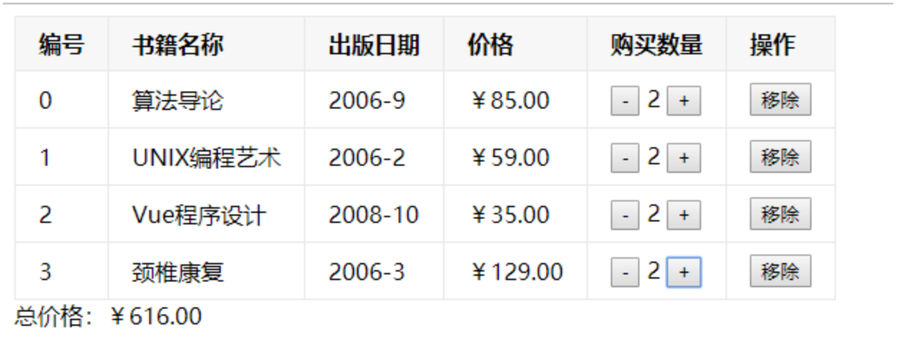

# 叩丁狼-Vue全家桶 第二天

## 学习目标

> 能够写出过滤器
>
> ​      不改变原数据的情况下,格式化数据.
>
> ​      全局过滤器  Vue.filter(名称,过滤函数(要处理的值){})
>
> ​      局部过滤器  filters:{  名称:function(要处理的值){ } }
>
> 能够写出Vue中计算属性computed中定义的函数
>
> ​      任何复杂逻辑处理的都可以放在计算属性内.
>
> ​      computed:{
>
> ​          //只读 * 
>
> ​          函数名/属性名(){
>
> ​               return 值
>
> ​         }
>
> ​         //读取和设置
>
> ​         属性名:{
>
> ​                 get(){  return 值  }
>
> ​                 set(val){ }
>
> ​         }
>
> ​     }
>
> 能够说出computed与methods区别
>
> ​     computed的有缓存,属性形式调用,对于重复性的  复杂逻辑处理的都可以放在计算属性内. ,提高效率
>
> 能够理解数组常用的方法并写出reduce,filter,map的案例，数组去重
>
> ​    reduce(function(pre,current){ return 100; },0)
>
>    includes()  返回布尔值

## 一、过滤器

Vue.js 允许你自定义过滤器，可被用于一些常见的文本格式化。过滤器可以用在两个地方：**双花括号插值和 v-bind 表达式**

vue中过滤器的作用可被用于一些常见的文本格式化。（也就是修饰文本，但是文本内容不会改变）

```vue
 <div id="box">
		 <p>{{ price | formatfn | testfn}}</p> 
		 <ul class="product">
			<li v-for="item in products">
				{{ item.name }} - {{item.price | discount(50) |format('￥') }}
			</li>
		</ul>
	 </div>
	 
	  <script> 
		let vm = new Vue({
			el:'#box',
			data:{
				price:900,
				products:[
					{name:'矿泉水',price:10},
					{name:'果汁',price:20}, 
				]
			},
			filters:{ 
				formatfn:function(val){
					return '$'+val;
				},
				testfn:function(val){
					return '*'+val;
				}, 
				format:function(myvalue,arg1){
					return `${arg1}${myvalue}`;
				}, 
				discount:function(myvalue,discount){
					return myvalue*discount/100;
				}
			}
		});
	 </script>
```

## 二、计算属性computed的使用

### 2.1 基本使用

模板内的表达式非常便利，但是设计它们的初衷是用于简单运算的。在模板中放入太多的逻辑会让模板过重且难以维护。

```vue
<div>
    翻转： {{ msg.split('').reverse().join('') }}
</div>
```

在这个地方，模板不再是简单的声明式逻辑。你必须看一段时间才能意识到，这里是想要显示变量 `message` 的翻转字符串。当你想要在模板中的多处包含此翻转字符串时，就会更加难以处理。

所以，对于任何复杂逻辑，你都应当使用**计算属性**。

```vue
<div id="app">
    <div>
        翻转： {{ msg.split('').reverse().join('') }}
    </div>
    <div>
        翻转： {{ reversedMsg}}
    </div> 
</div>
    
<script type="text/javascript">
    var vm = new Vue({
        el:'#app',
        data: {
            msg:"hello"
        },
        computed: {
            // 仅读取 
            reversedMsg: function () { 
                return this.msg.split('').reverse().join('');
            }
        }
    })
</script>
```

### 2.2 计算属性默认只有 getter，不过在需要时你也可以提供一个 setter

```vue
<div>
   {{numAPlus}} <button @click="change()">change</button>
</div>   
<script type="text/javascript">
    var vm = new Vue({
        el:'#app',
        data: { 
            numA:10 
        },
        computed: { 
            // 读取和设置
            numAPlus: {
                get: function () {
                    console.log("get"); 
                    return this.numA + 1;
                },
                set: function (v) {
                    console.log("set",v)
                    this.numA = v;
                }
            }
        },
        methods:{
            change(){
                this.numAPlus = 100; 
            }
        }
    })
</script>
```

### 2.3 计算属性computed和methods的区别

computed内部方法有缓存的作用

```vue
<body>
    <div id="app">
        <p>总价为: {{ totalPrice }}</p> 
        <p>总价为: {{ totalPrice }}</p> 
        <p>总价为: {{ totalPrice }}</p> 
        <p>总价为: {{getTotalPrice()}}</p>
        <p>总价为: {{getTotalPrice()}}</p>
        <p>总价为: {{getTotalPrice()}}</p>
    </div>
</body>  
<script type="text/javascript">
    var vm = new Vue({
        el:'#app',
        data: { 
            arr: [
                {name: 'Vuejs入门', price: 99, count: 3},
                {name: 'Vuejs底层', price: 89, count: 1},
                {name: 'Vuejs从入门到放弃', price: 19, count: 5},
            ]    
        },
        computed: {
            // 仅读取 
            totalPrice: function () {
                console.log("computed");
                let sum =0;
                for(let i =0;i<this.arr.length;i++){
                    sum+= this.arr[i].count * this.arr[i].price;
                }
                return sum;
            }, 
        },
        methods:{
            getTotalPrice(){
                console.log("methods");
                let sum =0;
                for(let i =0;i<this.arr.length;i++){
                    sum+= this.arr[i].count * this.arr[i].price;
                }
                return sum;
            }
        }
    })
</script>
```

## 三、数组常用方法

### 3.0 常用方法

* push() 往数组最后一位添加一个元素
* unshift() 往数组最后一位添加一个元素
* pop() 删除数组最后一个元素
* shift() 删除数组第一个元素
* splice() 删除，替换
* concat() 合并数组

````js
var arr = [1, 2, 3]
// 往数组最后一位添加一个数字
arr.push(4) // [1, 2, 3, 4]
// 删除数组最后一个数字
arr.pop()   // [1, 2, 3]
console.log(arr)
// 往数组第一位添加一个数字
arr.unshift(0)
console.log(arr)
// 删除数组第一个元素
arr.shift()
console.log(arr)
// splice
// 删除第一个元素
arr.splice(1, 2) 
console.log(arr)
arr.splice(1, 2, 2, 4, 5) 
console.log(arr)
// 合并数组
console.log([1, 6].concat([5, 7]))
````

push（返回数组长度）、unshift（返回数组长度）、shift（返回删除的值）、pop（返回删除的值）、splice、concat（返回新数组）

### 3.1 reduce()

利用reduce方法遍历数组的每一个元素，reduce()调用结果最后返回一个最终值（最后一次return值）。

```js
	var arr = [
       {name: 'Vuejs入门', price: 99, count: 3},
       {name: 'Vuejs底层', price: 89, count: 1},
       {name: 'Vuejs从入门到放弃', price: 19, count: 5},
    ]

    //数组名.reduce(回调函数，pre的初始值)
    arr.reduce(function(pre, current){
        // reduce这个方法被调用时，会遍历arr这个数组的每一个元素，每遍历一个元素，就执行一次这里的代码
        // current表示当前正在遍历的这个元素
        // pre 是上一次的这个函数return的值
        // ！！！因为第一次遍历没有上一个return值，所以，交给了第二个参数，设置pre的初始值
        console.log(pre, current)
        return 10
    },0)

	//！！！并且reduce方法最终会返回最后一次的return值
```

上面代码的输出结果：

```js
0 {name: "Vuejs入门", price: 99, count: 3}
10 {name: "Vuejs底层", price: 89, count: 1}
10 {name: "Vuejs从入门到放弃", price: 19, count: 5}
```

理解了上面的案例之后，就可以提一个需求：计算上面购物车的总价（每一个 price*count 的和），

```js
	//reduce方法最终会返回最后一次的return值
    var a = arr.reduce(function(pre, current){

        console.log(pre, current)

        // var total = 当前这次的 price*count + 上一次的total
        var total = current.price*current.count + pre
        return total
    },0)

    alert(a)   //这个a就是上面购物车的总价
```

备注：上面这个reduce()方法和Vue本身没有关系，纯粹是一个js数组的方法。

### 3.2 filter()

```js
	var arr = [1, 2, 3] 
    // 计算总数
    var ret1 = arr.reduce((pre, current)=>{
        pre += current
        return pre
    }, 0)
    console.log(ret1)  // 6

    // filter (过滤)
    var ret2 = arr.filter(item =>{
        return item > 2
    })
    console.log(ret2)  // [3] 
```

### 3.3 map() 和 forEach()

```js
    var arr = [1, 2, 3] 
    var ret3 = arr.map(item =>{
        return {id:item}
    })
    console.log(ret3)   // [{id: 1}, {id: 2}, {id: 3}]
```

### 3.4 数组去重

```vue
	var arr2 = [1, 2, 3, 1, 6, 2, 3]

    //ES6
    consoloe.log([...new Set(arr2)])
    console.log(Array.from(new Set(arr2)))

    var newArray = [];
    for(var i=0; i<arr2.length; i++){
        if(newArray.indexOf(arr2[i])==-1){
            newArray.push(arr2[i])
        }
    }
    console.log(newArray)

    var newArray2 = [];
    var obj = {};
    for(var i=0; i<arr2.length; i++){
        if(!obj[arr2[i]]){ //如果不在obj中，就表示不重复的数据，就在对象中添加键值对

            obj[arr2[i]] = arr2[i]
            newArray2.push(arr2[i])
        }
    }
    console.log(newArray2)
```

## 四、图书购物车案例



```vue
<div id="app">
        <table>
            <thead>
                <tr >
                    <th v-for="(title, tidx) in titles" :key="tidx">{{title}}</th>
                    <!-- <th>书籍名称</th>
                    <th>价格</th>
                    <th>出版日期</th>
                    <th>数量</th>
                    <th>操作</th> -->
                </tr>
            </thead>
            <tbody>
                <tr v-for="(book,bidx) in books" :key="book.name">
                    <td>{{bidx}}</td>
                    <td>{{book.name}}</td>
                    <td>{{book.price}}</td>
                    <td>{{book.date}}</td>
                    <td>
                        <button @click="sub(bidx)">-</button>
                        {{book.num}}
                        <button @click="add(bidx)">+</button>
                    </td>
                    <td>
                        <button @click="remove(bidx)">移除</button>
                    </td>
                </tr>
            </tbody>
        </table>
        <div>总价格:{{total}}</div>
    </div>
    <script>
        new Vue({
            el: '#app',
            data: {
                titles: ['编号', '书籍名称', '出版日期', '价格', '数量', '操作'],
                books: [
                    {
                        name: '算法导论',
                        date: '2006-9',
                        price: 85,
                        num: 1
                    },
                    {
                        name: 'UNIX编程艺术',
                        date: '2006-2',
                        price: 59,
                        num: 1
                    },
                    {
                        name: 'Vue程序设计',
                        date: '2008-10',
                        price: 35,
                        num: 1
                    },
                    {
                        name: '颈椎康复',
                        date: '2006-3',
                        price: 129,
                        num: 1
                    },
                ]
            },
            // 定义方法的地方
            methods: {
                add(idx) {
                    console.log(idx)
                    this.books[idx].num++
                },
                sub(idx) {
                    if (this.books[idx].num) {
                        this.books[idx].num--
                    }
                    
                },
                // 移除方法
                remove(idx) {
                    // 修改 增加 删除(下标, 删除数量, .....增加的元素)
                    this.books.splice(idx, 1)
                }
            },
            // 计算属性
            computed:{
                total() {
                    return this.books.reduce((pre, current) => {
                        return pre + current.price * current.num
                    }, 0)//总价格
                }
            }
        })
    </script>
```

