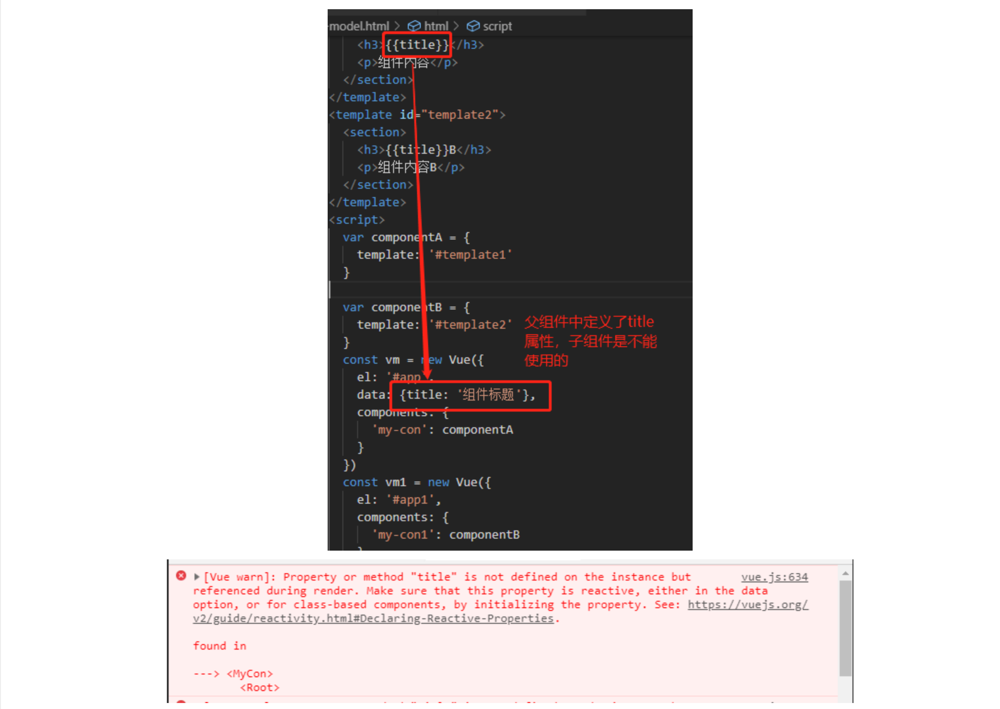
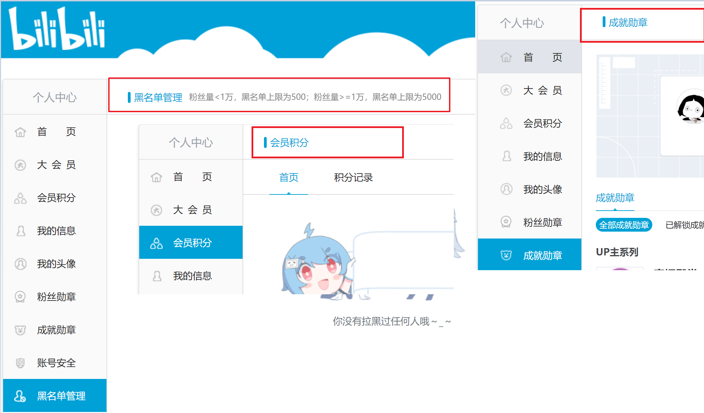
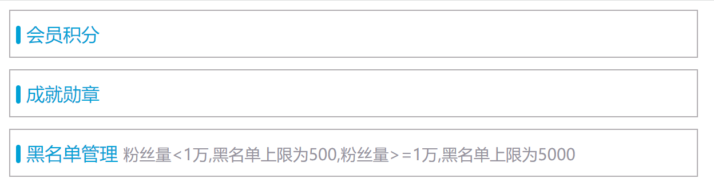
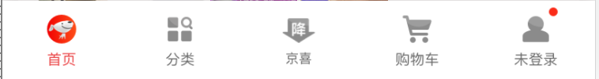
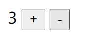

# 叩丁狼-Vue全家桶 第四天

## 目标

> 全局组件
>
> ​        Vue.component(name,{tepmlate:''})
>
> 局部组件
>
> ​       components:{name:{template:''}}
>
> 父子组件通讯 !!!!!(重要!!!!!)
>
> ​       父传子
>
> ​                 子:props:['name']
>
> ​                 父: <child name="值"></child>
>
> ​       子传父
>
> ​                 子: this.$emit('自定义名称',参数)
>
> ​                 父: <child @自定义名称="处理函数"></child>
>
> ​                getVal(val){
>
> ​                }
>
> 非父子组件通讯(兄弟组件)


## 一、(重点)Vue组件化开发

#### 1.1、什么是组件化？

> 面对复杂问题的处理方式，把问题拆解成很多个能处理的小问题，再将其放在整体中，会发现大的问题也会迎刃而解。
>
> 而组件化的思想也类似：
>
> 1. 如果我们实现一个页面结构和逻辑非常复杂的页面时，如果全部一起实现会变得非常复杂，而且也不利于后续的维护和迭代功能。
> 2. 但如果我们这时候把页面分成一个个小的功能块，每个功能块能完成属于自己这部分独立的功能，那么整个页面之后的维护和迭代也会变得非常容易。

* 组件化开发的优势：可维护性高    可复用性高

#### 1.2、Vue组件化思想

> 组件化是Vue重要的思想
>
> 1. 它提供了一种抽象，让我们可以开发出一个个独立可复用的小组件来构造我们的应用。
> 2. 任何的应用都会被抽象成一颗组件树。


> 组件化思想的应用开发：
>
> 1. 有了组件化的思想，我们在之后的开发中就要充分的利用它。
> 2. 尽可能的将页面拆分成一个个小的、可复用的组件。
> 3. 这样让我们的代码更加方便组织和管理，并且扩展性也更强。

#### 1.3、全局组件

> 通过`Vue.component('组件名称', {})`，通过这个方法注册的都是全局组件，也就是他们再注册之后可以用在任何新创建的`Vue` 实例挂载的区域内。


```html
<body>
  <div id="app">
    <my-con></my-con>
    <div>
      <my-con></my-con>
    </div>
  </div>
  <my-con></my-con>
</body>
<script>
  Vue.component('my-con', {
    template: '<section><h3>组件标题</h3><p>组件内容</p></section>'
  })
  const vm = new Vue({
    el: '#app'
  })
</script>
```

> 上面案例中，在`<div id="app">...</div>` 外的组件 `my-con` 没有替换成组件真正的页面结构，是因为 `new Vue()` 挂载在 `id=app` 的节点上，不在这个节点上标签，不会受到Vue的影响。


#### 1.4、局部组件

> 通过 `Vue.component` 方式注册的组件，称之为全局组件。任何地方都可以使用。全局注册往往是不够理想的。比如，如果你使用一个像 webpack 这样的构建系统，全局注册所有的组件意味着即便你已经不再使用一个组件了，它仍然会被包含在你最终的构建结果中。这造成了用户下载的 JavaScript 的无谓的增加。


**注册局部组件**

```html
<body>
  <div id="app">
    <my-con></my-con>
    <div>
      <my-con></my-con>
    </div>
  </div>
  <div id="app1">
    <my-con1></my-con1>
  </div>
</body>
<template id="template1">
  <section>
    <h3>组件标题</h3>
    <p>组件内容</p>
  </section>
</template>
<template id="template2">
  <section>
    <h3>组件标题B</h3>
    <p>组件内容B</p>
  </section>
</template>
<script>
  var componentA = {
    template: '#template1'
  }

  var componentB = {
    template: '#template2'
  }
  const vm = new Vue({
    el: '#app',
    components: {
      'my-con': componentA
    }
  })
  const vm1 = new Vue({
    el: '#app1',
    components: {
      'my-con1': componentB
    }
  })
</script>
```


**父组件和子组件**

> 组件和组件之间存在层级关系，而其中一种最重要的关系就是父子组件关系。    

#### 1.5、组件可以访问Vue实例数据吗？



>那组件如果要使用data定义自己属性保存数据要怎么做呢？
>
>1. 组件对象也有一个data的属性（也有methods等属性，下面我们有用到）
>2. 只是这个data属性必须是一个函数，而且函数返回一个对象 ，对象保存着数据

#### 1.6、父子组件间的通讯

##### 父级向子级传递

> 在组件中，使用选项props来声明需要从父级接收到的数据。
>
> props的值有两种方式：
>
> 1. 字符串数组，数组中的字符串就是传递时的名称。
> 2. 对象，对象可以设置传递时的类型（String，Number，Boolean，Array， Object，Date，Function，Symbol），也可以设置默认值等。


```html
<body>
  <div id="app1">
    <my-con1></my-con1>
  </div>
</body>

<template id="template2">
  <section>
    <h3>{{title}}B</h3>
    <p>组件内容B</p>
    <!-- my-con1组件内的aa组件 --> 
    <aa v-bind:parent-txt="childtxt"></aa>
  </section>
</template>
<script>
  var componentB = {
    template: '#template2',
    data() {
      return {
        title: 'zj',
        childtxt: 'child text'
      }
    },
    components: {
      'aa': {
        template: '<div>{{parentTxt}}</div>',
        props: ['parentTxt']
      }
    }
  }
  
  const vm1 = new Vue({
    el: '#app1',
    components: {
      'my-con1': componentB
    }
  })
</script>
```

**练习：** 实现导航组件复用



完成效果图：



**练习：**

使用组件的形式显示如下效果



##### 子级向父级传递

> 父组件向子组件传递数据，通过自定义事件

```html
<body>
  <div id="app1">
    <my-con1></my-con1>
  </div>
</body>

<template id="template2">
  <section>
    <h3>{{title}}B</h3>
    <p>组件内容B</p>
    <aa v-bind:parent-txt="childtxt" v-on:changetitle="changeTitle"></aa>
  </section>
</template>
<script>
  var componentB = {
    template: '#template2',
    data() {
      return {
        title: 'zj',
        childtxt: 'child text'
      }
    },
    components: {
      'aa': {
        template: '<div v-on:click="change">{{parentTxt}}</div>',
        props: ['parentTxt'],
        methods: {
          change() {
            this.$emit('changetitle', {
              a: 1
            })
          }
        }
      }
    },
    methods: {
      changeTitle(obj) {
        console.log(obj)
        this.title = obj.a
      }
    }
  }

  const vm1 = new Vue({
    el: '#app1',
    components: {
      'my-con1': componentB
    }
  })
</script>
```

> 案例分析：
>
> 1. 现在的需求是点击子组件`aa` 然后把父组件`my-con1`上的标题给改变；
> 2. 首先，在父组件的具体页面结构找到子组件`aa` ，在子组件`aa` 上使用`v-on:changetitle="changeTitle"` , `changetitle`是子组件的自定义事件名称，`changeTitle`是父组件`my-con1`里的`methods`属性定义的方法；
> 3. 其次，在子组件`aa`里为div绑定点击事件 `v-on:click="change"`, 在子组件`aa`里的methods定义change方法，change方法里使用`this.$emit('changetitle')`，使用$emit方法来触发绑定在子组件上的自定义事件，$emit第一个参数就是上一步定义的自定义事件`changetitle`,第二个参数就是传递到父组件的参数，可以不传。


**弹窗案例**


```vue
<!DOCTYPE html>
<html lang="en">

<head>
  <meta charset="UTF-8">
  <meta name="viewport" content="width=device-width, initial-scale=1.0">
  <meta http-equiv="X-UA-Compatible" content="ie=edge">
  <title>Document</title>
  <style>
    * {
      margin: 0;
      padding: 0;
    }
    html,body, #app1{
      width: 100%;
      height: 100%;
    }
    
    .wrapper {
      display: flex;
      justify-content: center;
      align-items: center;
      width: 100%;
      height: 100%;
      background-color: rgba(0,0,0, 0.3);
    }
    .content {
      width: 220px;
      height: 160px;
      background-color: #fff;
    }
    .title {
      height: 40px;
      line-height: 40px;
      text-align: center;
    }
    .msg {
      display: flex;
      align-items: center;
      justify-content: center;
      box-sizing: border-box;
      padding: 5px 10px;
      border-top: 1px solid #eee;
      border-bottom: 1px solid #eee;
      height: 80px;
      text-align: center;
      color: gray;
      font-size: 14px;
    }
    .bottom {
      display: flex;
      height: 40px;
      line-height: 40px;
      text-align: center;
    }
    .bottom div {
      flex: 1;
      color: green;
    }
    .bottom div:nth-of-type(1) {
      border-right: 1px solid #eee;
      color: red;
    }
  </style>
  <script src="https://cdn.jsdelivr.net/npm/vue/dist/vue.js"></script>
</head>
<body>
  <div id="app1">
    <my-con v-show="showCon" :txt-obj="textObj" @btn-handle="handleBtnClick"></my-con>
  </div>
</body>

<template id="template1">
    <div class="wrapper">
        <div class="content">
          <p class="title">{{txtObj.title}}</p>
          <div class="msg">{{txtObj.msg}}</div>
          <div class="bottom">
            <div @click="cancel">{{txtObj.cancelTxt}}</div>
            <div @click="submit">{{txtObj.submitTxt}}</div>
          </div>
        </div>
      </div>
</template>
<script>
  var componentA = {
    template: '#template1',
    props: {
      txtObj: {
        type: Object,
        default: {}
      }
    },
    methods: {
      cancel() {
        // 自定义事件名称建议全小写
        this.$emit('btn-handle', 'cancel')
      },
      submit() {
        // 自定义事件名称建议全小写
        this.$emit('btn-handle', 'submit')
      },
    }
  }
  const vm1 = new Vue({
    el: '#app1',
    data: {
      textObj: {
        title: 'bug提示',
        msg: '亲，你还有53633个bug，是否要处理?',
        cancelTxt: '忽略，下班',
        submitTxt: '加班处理'
      },
      showCon: true
    },
    components: {
      myCon: componentA
    },
    methods: {
      handleBtnClick(type) {
        console.log(type)
        if (type === 'cancel') {
          this.showCon = false
        }
      }
    }
  })
</script>

</html>
```

#### 1.7、非父子组件通讯

采用 event bus 的方式适合简单的跨组件事件触发，对于多层级组件嵌套等较为复杂的场景，使用 vuex 能更好地应对。

> 实际工作中如果遇到跨组件或者非父组件间的传递数据，那该怎么办？第一个可以使用中央事件总线，也就是一个中介来完成。第二个就是使用 `Vuex` 提供的功能，这里先暂时不讨论这种方案，后续专门学习Vuex。


**案例：**点击按钮1，改变按钮2的背景颜色


```vue
<!DOCTYPE html>
<html lang="en">

<head>
  <meta charset="UTF-8">
  <meta name="viewport" content="width=device-width, initial-scale=1.0">
  <meta http-equiv="X-UA-Compatible" content="ie=edge">
  <title>Document</title>
  <script src="https://cdn.jsdelivr.net/npm/vue/dist/vue.js"></script>
</head>

<body>
  <div id="app1">
    <my-con></my-con>
    <my-con1></my-con1>
  </div>
</body>

<template id="template1">
  <button @click="click1">按钮1</button>
</template>
<template id="template2">
  <button @click="click2" :style="{backgroundColor: fontColor}">按钮2</button>
</template>
<script>
  const bus = new Vue();
  const componentA = {
    template: '#template1',
    methods: {
      click1() {
        // 点击按钮1
        bus.$emit('xxx', this.getRandomColor());
      },
      getRandomColor() {
        return `rgb(${this.getRandomNum()},${this.getRandomNum()},${this.getRandomNum()})`
      },
      getRandomNum() {
        return Math.floor(Math.random() * 256)
      }
    }
  }
  const componentB = {
    template: '#template2',
    data() {
      return {
        fontColor: ''
      }
    },
    methods: {
      click2() {
        // 点击按钮2
      }
    },
    mounted() {
      bus.$on('xxx', (color) => {
        console.log(color)
        this.fontColor = color
      })
    }
  }
  const vm1 = new Vue({
    el: '#app1',
    components: {
      myCon: componentA,
      myCon1: componentB
    }
  })
</script>

</html>
```


## 练习

两种方式实现 加减功能。

1. 父子传值方式
2. 空实例中转站方式

 

