# 叩丁狼-Vue全家桶 第六天

## 学习目标

>webpack  : 自动化 模块化 前端开发构建工具
>
>​                    作用: 打包 优化 转化...
>
>打包命令:   webpack index.js --output './dist/index.js'
>
>配置文件: webpack.config.js
>
>​                 (entry,output,plugins,mode,module,devServer)
>
>打包命令:  webpack --config webpack.config.js
>
>webpack : json 和 js
>
>如果需要打包less css... 需要 进行loader安装及配置
>
>html-webpack-plugin 自动打包输出html文件. 可以配置template和输出地址
>
>webpack-dev-serve:  开发服务器
>
>配置热更新 : 修改内容自动更新 .类似于live server插件功能.

> 非父子组件传值: 空实例作为中转站
>
> let bus = new Vue();
>
> 监听:  bus.$on("事件名",data=>{})
>
> 触发监听: bus.$emit('事件名',数据)


## 一、Webpack（自动化 模块化 前端开发构建工具） 

>从本质上来说，webpack是一个**静态模块打包工具**。
>要想让我们写好的模块化代码在各式各样的浏览器上能做到兼容，就必须借助于其他工具；而webpack的其中一个核心就是让我们可>以进行模块化开发，并帮我们处理模块间的依赖关系。不仅仅是Javascript文件，我们的css、图片、json文件等在webpack中都
>可以当作模块来使用，这就是webpack的模块化概念。

如果像以前开发时一个html文件可能会引用十几个js文件,而且顺序还不能乱，因为它们存在依赖关系，同时对于ES6+等新的语法，less, sass等CSS预处理都不能很好的解决……，此时就需要一个处理这些问题的工具。

Webpack就是为处理这些问题而生的，它就是把你的项目当成一个整体，通过一个入口主文件（如：index.js）,从这个文件开始找到你的项目所有的依赖文件并处理它们，最后打包成一个（或多个）浏览器可识别的JavaScript文件。

1. 有一个很大的单页应用，为了提高开发效率，要将这个项目拆成多个模块，开发完成后，这个项目可以正常跑了。但是因为多个模块是存在不同文件中的，因此加载这个单页应用时，会发出多次请求。这时我们希望能够把所有模块打包成一个文件，这样可以减少请求次数，提升体验。
2. 在开发这个单页应用中，同样是为了提高开发效率，使用了一些js和css的扩展语言，如TypeScript及Less、stylus，这些扩展使我们可以更简洁优雅地写代码，但是开发完成开始部署时，需要将它们进行相应的转换，转换成浏览器支持的语言。这时，我们希望能够有个工具可以以很大的自动化程度去完成这个转换工作。
3. 在这个单页应用开发完成后，我们为了提高其性能，希望做一些列处理，如把js进行压缩。

在单页应用的开发中，一般情况都会遇到这3种场景，而在这三种场景webpack可以下满足我们的上述需求。通常webpack被认为是一个模块打包机，实际上它的功能不仅限于模块打包（即第一种场景下的功能），还可以进行扩展语言翻译和文件优化处理。

(逻辑多，文件多，项目的复杂性提高。)


作用:

1, 打包(压缩 减少服务器的压力)

2.转化(es6->es5)

3.优化

### 1. gulp和webpack

> Gulp侧重于前端开发的 **整个过程** 的控制管理（像是流水线），我们可以通过给gulp配置不同的task（通过Gulp中的gulp.task()方法配置，比如启动server、sass/less预编译、文件的合并压缩等等）来让gulp实现不同的功能，从而构建整个前端开发流程。

**gulpfile.js**

```js
var gulp = require('gulp');
var uglify = require('gulp-uglify'); //压缩代码

// 压缩js
gulp.task('uglify',function(){
    var combined = combiner.obj([
        gulp.src('src/scripts/**/*.js'), //需要压缩的js文件路径
        sourcemaps.init(),
        uglify(), //压缩js
        sourcemaps.write('./'),
        gulp.dest('dest/scripts') //生成的js文件的目录
    ]);
});

//默认任务
gulp.task('default',['uglify']);
```

> Webpack有人也称之为 **模块打包机** ，由此也可以看出Webpack更侧重于模块打包，当然我们可以把开发中的所有资源（图片、js文件、css文件等）都可以看成模块，最初Webpack本身就是为前端JS代码打包而设计的，后来被扩展到其他资源的打包处理。Webpack是通过loader（加载器）和plugins（插件）对资源进行处理的。

### 2. webpack初体验

#### 1. 生成项目依赖文件

```js
// 执行后生成package.json文件
npm init -y
```

#### 2. 安装依赖（node环境在12.10.0下！）

nvm install 12.10.0

nvm use 12.10.0

node -v

npm i webpack@4.44.1 webpack-cli@3.3.12 -g

```js
npm init -y
// 最后的参数-D是安装到package.json的开发依赖devDependencies(开发环境)对象里，也可以用 --save-dev代替
npm install webpack@4.44.1 webpack-cli@3.3.12 -D

// 全局安装webpack和webpack-cli
npm i webpack@4.44.1 webpack-cli@3.3.12 -g

// -S是--save的简写，这样安装的话，会安装到dependencies(生产环境)对象里，也可以用 --save代替
npm install jquery -S
```

```js
// package.json
{
  "name": "webpack-demo",
  "version": "1.0.0",
  "description": "",
  "main": "index.js",
  "scripts": {
    "test": "echo \"Error: no test specified\" && exit 1"
  },
  "author": "",
  "license": "ISC",
  "devDependencies": {
    "webpack": "^4.40.2",
    "webpack-cli": "^3.3.9"
  },
  "dependencies": {
    "jquery": "^3.4.1"
  }
}

```

#### 3. npm

npm是随同Node.js一起安装的包管理工具
通过npm可以共享使用各式JS开源库,对JS开源库的版本可以直接快速的管理,使用这些基于模块开发方式让团队更好的协作开发

##### 全局安装和本地安装

npm install <Module name> [-g] :使用npm安装模块
npm list: 查看安装信息
npm uninstall <Module name>:卸载模块
npm update <Module name>:更新模块
npm view <Module name> versions 查看npm上有哪些版本 , 例如npm view less-loader versions 

##### cnpm的安装和使用

安装指令:npm install cnpm -g --registry=https://registry.npm.taobao.org

##### --save与--save-dev 区别

dependencies是运行时依赖，devDependencies是开发时的依赖
--save 会把依赖包名称添加到 package.json 文件 dependencies 下
--save-dev 会把依赖包添加到 package.json 文件 devDependencies 下

> devDependencies与dependencies的区别：
>
> 在发布npm包的时候，本身dependencies下的模块会作为依赖，一起被下载；devDependencies下面的模块就不会自动下载了；但对于项目而言，npm install 会自动下载devDependencies和dependencies下面的模块。

### 3.创建入口文件

`index.html`

```html
<!DOCTYPE html>
<html lang="en">
<head>
  <meta charset="UTF-8">
  <meta name="viewport" content="width=device-width, initial-scale=1.0">
  <meta http-equiv="X-UA-Compatible" content="ie=edge">
  <title>Document</title>
</head>
<body>
  <ul>
    <li></li> 
     ... 
    <li></li>
  </ul>
</body>
<script src="./index.js"></script>
</html>
```


`index.js`

```js
import $ from 'jquery'
$('ul li:even').css({background: 'red'})
$('ul li:odd').css({background: 'green'})
```

在浏览器打开

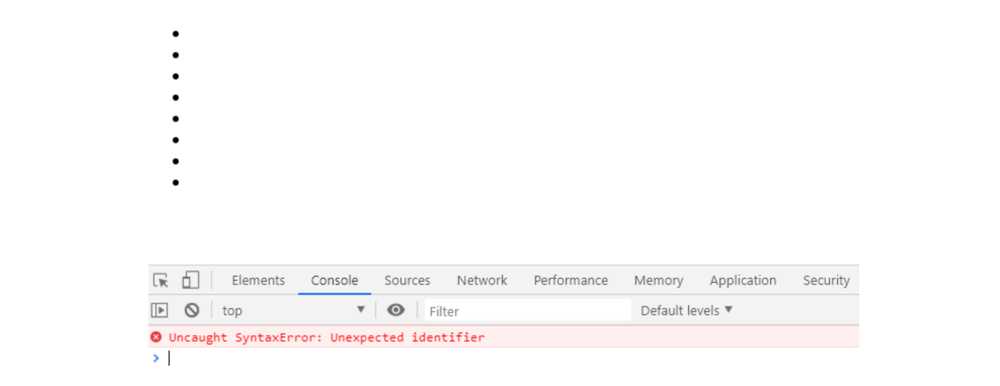

> 为什么会这样？因为浏览器并不兼容import引入模块这种方式，所以我们要用到webpack打包

### 4. 通过webpack打包

```js
// 执行命令  output输出
// 语法 webpack 入口 --output 输出地址 
webpack index.js -o dist/bundle.js
```


> 出现这个报错，这是因为命令行执行时候会找全局的webpack，但是我们并没有安装全局的webpack，所以我们可以安装全局webpack，或者是使用脚本方式启动

**package.json**

```js
{
  "name": "webpack-demo",
  "version": "1.0.0",
  "description": "",
  "main": "index.js",
  "scripts": {
    "start": "webpack index.js -o dist/bundle.js"
  },
  "author": "",
  "license": "ISC",
  "devDependencies": {
    "webpack": "^4.40.2",
    "webpack-cli": "^3.3.9"
  },
  "dependencies": {
    "jquery": "^3.4.1"
  }
}

```


执行package.json文件中添加的start命令

```js
// 生成 dist文件夹和bundle.js文件
npm run start
```


然后再把index.html原来引入index.js的地方改成是通过webpack生成的bundle.js

```html
<!--index.html文件-->
<!--<script src="./index.js"></script>-->
<script src="./dist/bundle.js"></script>
```


最终浏览器看到的效果：

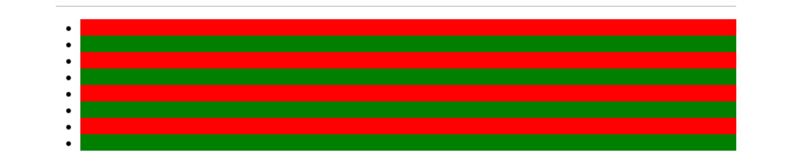

### 5. webpack.config.js

优化：

> webpack index.js -o dist/bundle.js 这一句其实是可以写在一个配置文件里

**webpack.config.js：**

```js
const path = require('path');

module.exports = {
  entry: path.join(__dirname, './index.js'),	// dirname代表索引到文件所在目录
  output: {
    path: path.join(__dirname, './dist'),
    filename: 'bundle.js'
  }
}
```

**package.json：**

```json
"scripts": {
    "start": "webpack --config webpack.config.js"
  }
```

#### 配置文件整体构成

**webpack.config.js** 

* entry（入口）

  配置webpack以哪个文件为入口起点开始打包

  entryKey:'./src/index.js'
  
* output（出口）

  配置webpack打包后的资源bunduls输出到哪里，以及如何命名

  output:{path:路径,filename:文件名}  //默认输出到dist目录下
  
  //__dirname node.js变量，表示绝对路径
  
  output:{path:path.resolve(__dirname,'dist/'),filename:bundle.js} 

* loader（转化器） 

  webpack自身只认识js和json。loader指示webpack去处理非js资源例如css，img等，将它们处理成webpack能够认识的资源 。 翻译官。

  1. `test` 属性，用于标识出应该被对应的 loader 进行转换的某个或某些文件。
  2. `use` 属性，表示进行转换时，应该使用哪个 loader。

* plugins （插件）

  可用于执行范围更广的任务。 打包，压缩，环境配置等。

* mode （模式）

  告知webpack使用对应模式配置

  development 开发配置：能让代码本地调试运行的环境

  production  生产环境：能让代码优化上线运行的环境。

  （都会使用一些插件，生产环境使用的插件更多） 

* devServer （开发服务器）


### 6. mode设置

在执行打包工作时，提示的警告信息：

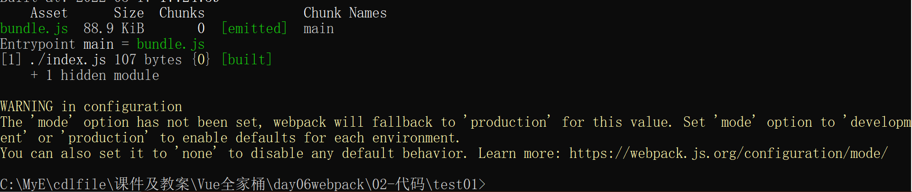


mode模式 告知webpack使用对应模式配置

development 开发配置：能让代码本地调试运行的环境

production 生产环境：能让代码优化上线运行的环境。 

```js
module.exports ={
   mode:'production'
}
```

###  7. html-webpack-plugin

安装：`npm install html-webpack-plugin@4.5.1 -D`

**webpack.config.js**

```js
const path = require('path');
const HtmlWebpackPlugin = require('html-webpack-plugin');

module.exports = {
  entry: path.join(__dirname, './index.js'),
  output: {
    path: path.join(__dirname, './dist'),
    filename: 'bundle.js'
  },
  plugins: [
    new HtmlWebpackPlugin({
      template: path.join(__dirname, './index.html'),
      filename: 'index.html'
    })
  ]
}
```

> 删掉index.html文件里面的bundle.js引用，因为html-webpack-plugin会自动把打包出来的bundle自动加到我们的index.html代码里

### 8. loader 配置

webpack自身只认识js和json。loader指示webpack去处理非js资源例如css，img等，将它们处理成webpack能够认识的资源 。 翻译官。

1. `test` 属性，用于标识出应该被对应的 loader 进行转换的某个或某些文件。
2. `use` 属性，表示进行转换时，应该使用哪个 loader。

```js
module:{
    //loader的配置
    rules:[{
            test:/\.js$/,
        	use:[] //解析器列表 
    }]
}
```

#### 8.1 css-loader

创建一个index.css

**index.css**

```css
body {
    background: skyblue;
}
```


**index.js**

```js
import $ from 'jquery'
$('ul li:even').css({background: 'gray'})
$('ul li:odd').css({background: 'green'})

import './index.css'
```

执行npm run start

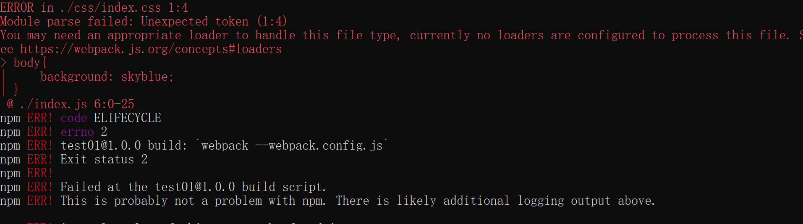

> 为什么报错，因为webpack默认是不识别`.css`文件的，需要我们通过 `loader`  将 `.css` 文件进行解释成正确的模块。


**安装css-loader和style-loader**

```js
npm install css-loader@5.2.4 style-loader@2.0.0 -D 
//index.css -> bundle.js -> style-loader -> <style> index.html
// css-loader的作用是将index.css文件解析为webpack能识别的模块，然后打包进bundle.js里面，但是这样样式并未成功显示在浏览器中。
// style-loader的作用就是将打包到bundle.js中的样式绑定到浏览器上，以style标签的形式显示出来
```


**webpack.config.js**

```js
const path = require('path');
const HtmlWebpackPlugin = require('html-webpack-plugin');

module.exports = {
  entry: path.join(__dirname, './index.js'),
  output: {
    path: path.join(__dirname, './dist'),
    filename: 'bundle.js'
  }, 
  module: {
    rules: [{
      test: /\.css$/,
      use: ['style-loader', 'css-loader']	// 注意：这里的数组是反向读取的（即从右往左）
    }]
  }
}
```


#### 8.2 less-loader

> 补充：引入的文件是less
>
> 安装：npm install less-loader@7.2.1 less@4.1.0 -D
>
> 规则： 
>
> ```js
> {
>     test: /\.less$/,
> 	use: ['style-loader', 'css-loader', 'less-loader']
> }
> ```
>

#### 8.3 file-loader

```shell
  - 1.安装file-loader  
    - npm i file-loader@6.2.0  -D
  - 2.配置loader
   {
       test:/\.(jpg|png|gif|jpeg|bmp)$/,
       use:['file-loader']
   }  
```

#### 8.4 ES6 转 ES5 

> 安装依赖包

```js
npm install babel-core babel-loader@7.1.5 babel-plugin-transform-runtime@6.23.0 babel-preset-env@1.7.0 babel-preset-stage-0@6.24.1 -D
```

```js
const fn = () => {
  console.log(123)
}
```


> 配置loader 

```js
{test:/\.js/,use:['babel-loader'],exclude:/node_modules/} 
```

exclude表示排除掉 node_modules下载的依赖项。这样可以加速网站开发，而且我们也只需要对我们的项目src 

源文件进行编译即可。

 

> 新增.babelrc文件 

```json
{ 
    "presets":["env","stage-0"], 
    "plugins":["transform-runtime"] 
} 
```


新增并在index.js中引入main.js，然后使用es6语法 

```js
const fn = () => {
  console.log(123)
}

fn()
```


执行命令编译 

```shell
npm run start 
```


编译后的结果

```js
var fn = function fn() {\n    console.log(123);\n}
```

### 9. webpack-dev-server

> 这时候如果修改index.html的背景颜色red改成是gray，会发现浏览器刷新也没有效果，需要再跑一次`npm run start`命令才有用，这时候就需要webpack-dev-server(热重载)

**安装：**

```js
npm install webpack-dev-server@3.11.2 -D
```

**配置方式**

```
    devServer: {
        //本地服务目录 (运行代码目录)
        contentBase: path.resolve(__dirname, 'dist'),
        //域名，ip地址
        host: '127.0.0.1',
        //端口号
        port: 8000,
        //自动打开浏览器
        open: true,
        //开启HMR功能 热模块替换 (修改配置记得重启)
        hot: true
    }
```


**package.json：**

```json
"scripts": {
    "start": "webpack-dev-server --config webpack.config.js --open --port 3002 --hot"
  }
// --open 自动打开浏览器
// --port 服务监听的端口 3002
// --hot  自动更新

```

> 这里注意：
>
> 1、启动webpack-dev-server后， 你在目标文件夹中是看不到编译后的文件的，实时编译后的文件都保存到了内存当中。想看到bundle.js文件，可以运行localhost:3002/bundle.js查看
>
> 
>
> 2、既然bundle.js已经不在dist目录下，因此，如果没有其他的webpack配置项，上面的命令也可以简写为：
>
> ```js
> "scripts": {
> "start": "webpack-dev-server --open --port 3002 --hot"
> }
> ```

**index.html**

```html
<script src="./bundle.js"></script>
```

### 10. html热更新

在安装过html-webpack-plugin之后，安装：

```js
npm install --save-dev raw-loader@4.0.2
```

在webpack.config.js中配置raw-loader:

```js
module.exports = {
  ......
  module: {
    rules: [
      {
         test: /\.(htm|html)$/,
         use: [
           'raw-loader'
         ]
      },
      ......
    ]
  }
}
```

在 `index.js` 中引入html：

```js
import './index.html'
```


## 二、Vue CLI使用准备


- node版本 node -v
- npm版本 npm -v
- vue-cli版本 vue -V

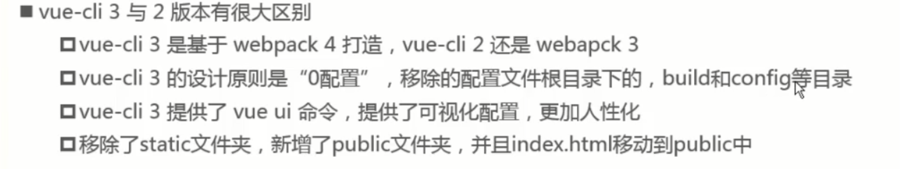

### Node版本

> Vue CLI 需要Node.js 8.9 或者更高版本（推荐使用 <font color="red">12.11.0</font>）。你可以使用`nvm` 或 `nvm-window`来管理电脑上面的Node版本。


**安装Vue CLI脚手架的包：**

```js
npm install -g @vue/cli
# OR
yarn global add @vue/cli
```

安装之后，你就可以在命令行中访问 `vue` 命令。你可以通过简单运行 `vue`，看看是否展示出了一份所有可用命令的帮助信息，来验证它是否安装成功。

你还可以用这个命令来检查其版本是否正确 (4.x)：

```bash
vue --version
vue -V
```


如果安装比较慢，可以把下载源切换成淘宝的源：

npm  对应的淘宝下载源设置：

```shell
//切换taobao镜像源
npm config set registry https://registry.npm.taobao.org/
// 查看下载源
npm config get registry
```

yarn  对应的淘宝下载源设置：

```shell
//切换taobao镜像源
yarn config set registry https://registry.npm.taobao.org/

// 查看下载源
yarn config get registry
```


## 三、创建项目

### 3.1 初始化项目方式一：

**vue create**

运行以下命令来创建一个新项目：

```js
vue create hello-world
```


你会被提示选取一个 preset。你可以选默认的包含了基本的 Babel + ESLint 设置的 preset，也可以选“手动选
择特性”来选取需要的特性。

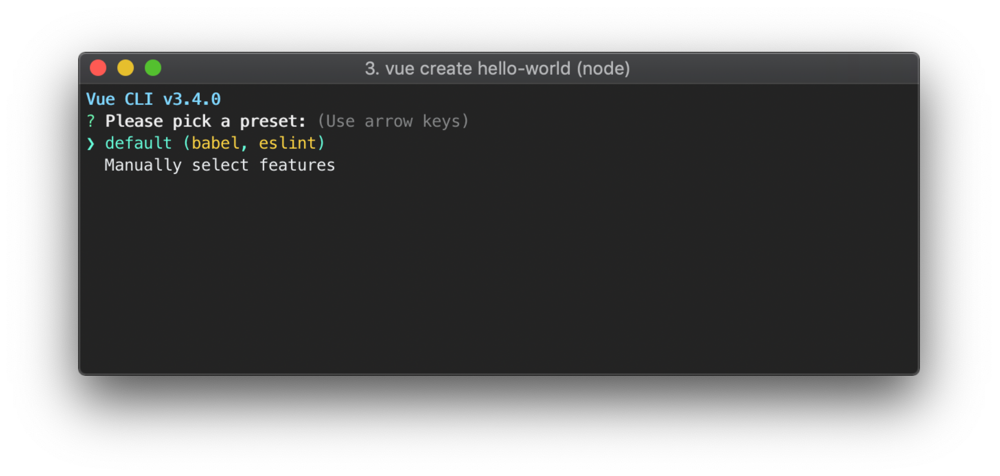

这个默认的设置非常适合快速创建一个新项目的原型，而手动设置则提供了更多的选项，它们是面向生产的项目更加需要的。

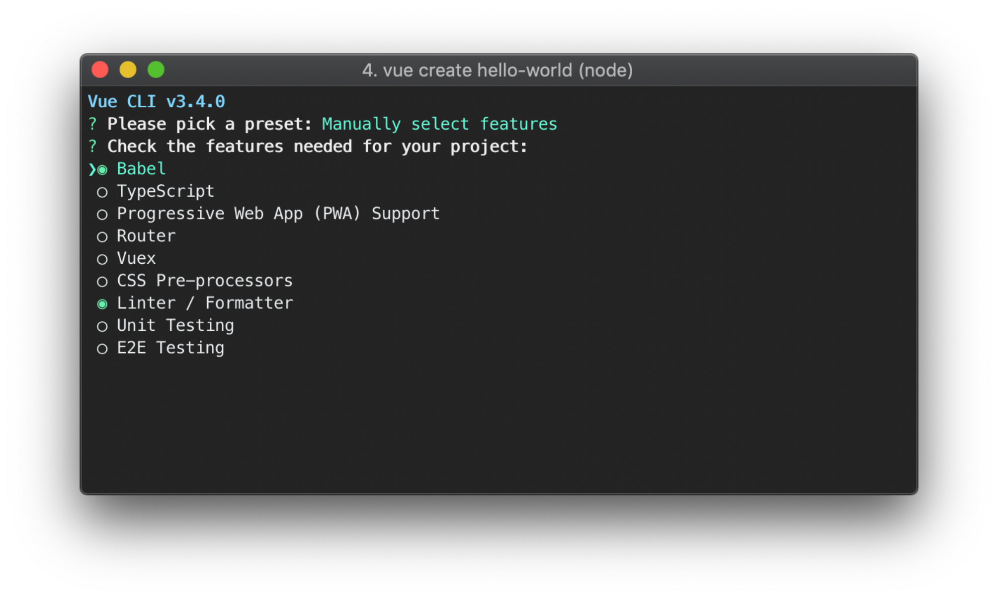

1) vue create 项目名称
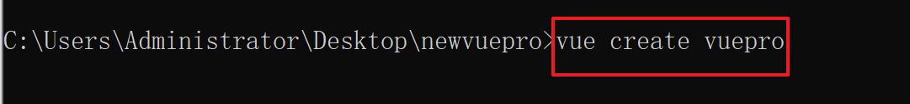 


2）选择默认配置或者自定义配置
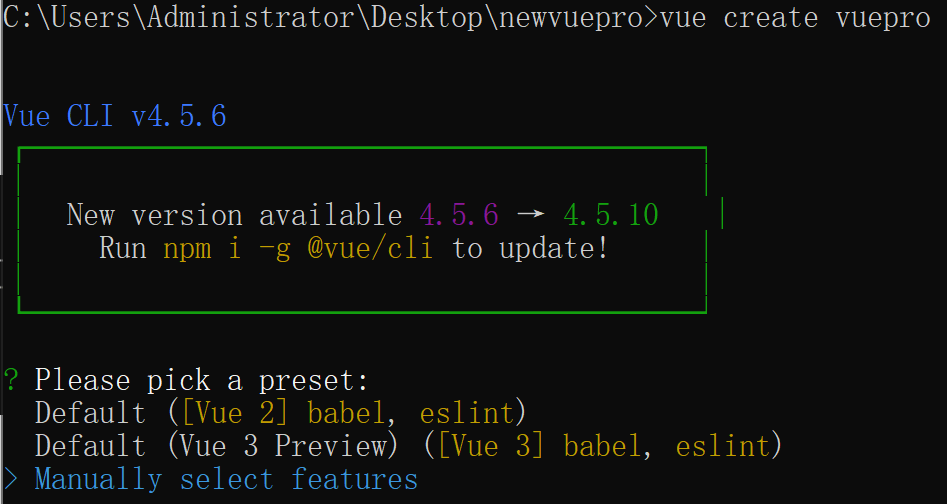 


3）选择需要安装项

 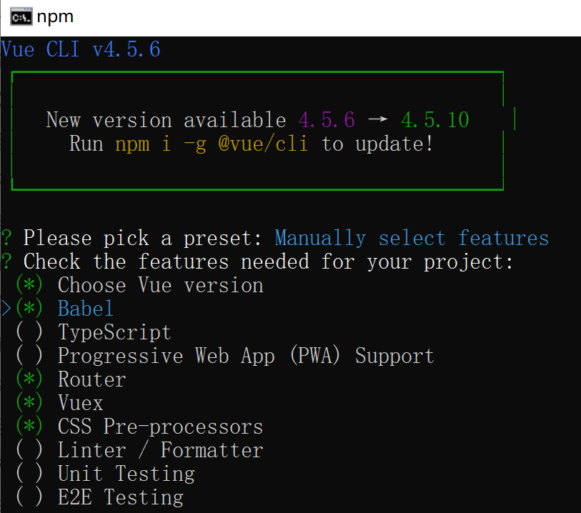


当你选择后会出现上面图上的东西，这里你可以自由选择用哪些配置，按上下键选择哪一个，按空格键确定，所有的都选择好后，按enter键进行下一步，这里演示，我随便选了几个

4)选择vue版本
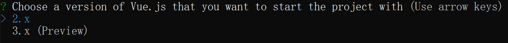 


4）是否要以history模式 【如果安装了Router，会出现下面选择】
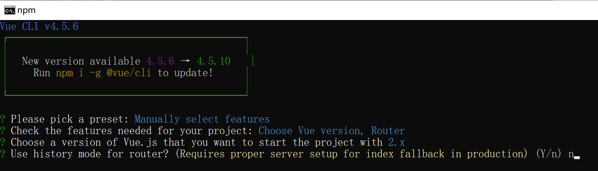 


是否要以history模式，如果选择yes，后端还需要作操作。路径好看 http://localhost:8080/about
选择no，后端无须修改操作。路径不好看 http://localhost:8080/#/

5）选择css预处理器 【如果安装了Css Pre ...，会出现下面选择】
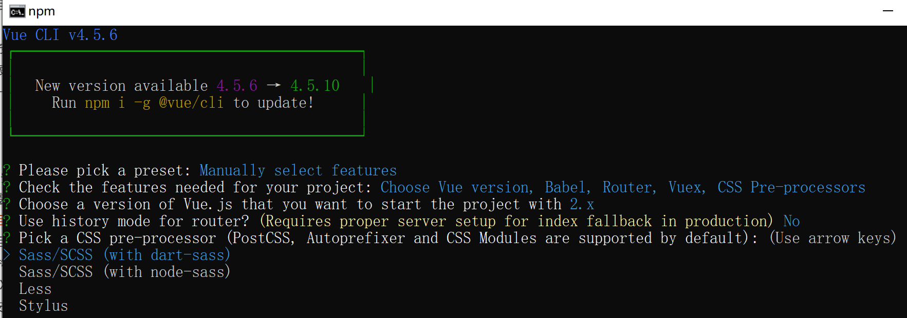 


Sass/SCSS (with dart-sass)  ：世界上最成熟、最稳定、最强大的专业级CSS扩展语言
Sass/SCSS (with node-sass)  ：世界上最成熟、最稳定、最强大的专业级CSS扩展语言  (推荐)
Less     ：(推荐) 一门 CSS 预处理语言,它扩展了 CSS 语言,增加了变量、Mixin、函数等特性
Stylus   ： 富于表现力、动态的、健壮的 CSS

6）选择格式化配置方案  【如果安装了eslink，会出现下面选择】
 ESLint with error prevention only  仅错误预防
 ESLint + Airbnb config  Airbnb配置
 ESLint + Standard config 标准配置
 ESLint + Prettier

7）选择配置文件存放方式
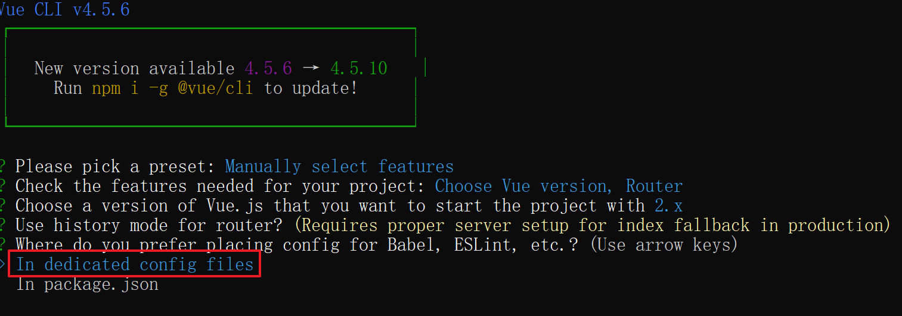 


上边这俩意思问，babel,postcss,eslint这些配置文件放哪？
第一个是：放独立文件放置
第二个是：放package.json里
这里推荐放单独配置文件 

8）是否将以上这些将此保存为未来项目的预配置吗
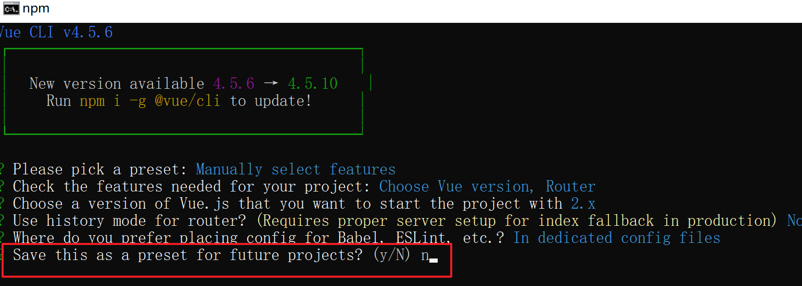 


就有你以前选择的配置了，不用重新再配置一遍了
最后回车开始下载模板了


对于每一项的功能，此处做个简单描述：

> ( ) Choose Vue verion //选择vue版本
> ( ) Babel //转码器，可以将ES6代码转为ES5代码，从而在现有环境执行。 
> ( ) TypeScript       // TypeScript是一个JavaScript（后缀.js）的超集（后缀.ts）包含并扩展了 JavaScript 的语法，需要被编译输出为JavaScript在浏览器运行 
> ( ) Progressive Web App (PWA) Support// 渐进式Web应用程序
> ( ) Router // vue-router（vue路由）
> ( ) Vuex // vuex（vue的状态管理模式）
> ( ) CSS Pre-processors // CSS 预处理器（如：less、sass）
> ( ) Linter / Formatter // 代码风格检查和格式化（如：ESlint）
> ( ) Unit Testing // 单元测试（unit tests）
> ( ) E2E Testing // e2e（end to end） 支持E2E测试

如果你决定手动选择特性，在操作提示的最后你可以选择将已选项保存为一个将来可复用的 preset


> ~/.vuerc
>
> 被保存的 preset 将会存在用户的 home 目录下一个名为 `.vuerc` 的 JSON 文件里。如果你想要修改被保存的 preset / 选项，可以编辑这个文件。
>
> 在项目创建的过程中，你也会被提示选择喜欢的包管理器或使用[淘宝 npm 镜像源](https://npm.taobao.org/)以更快地安装依赖。这些选择也将会存入 `~/.vuerc`。


### 3.2 初始化项目方式二：图形化操作

图形化操作： vue ui

### 3.3 项目结构

**项目目录**

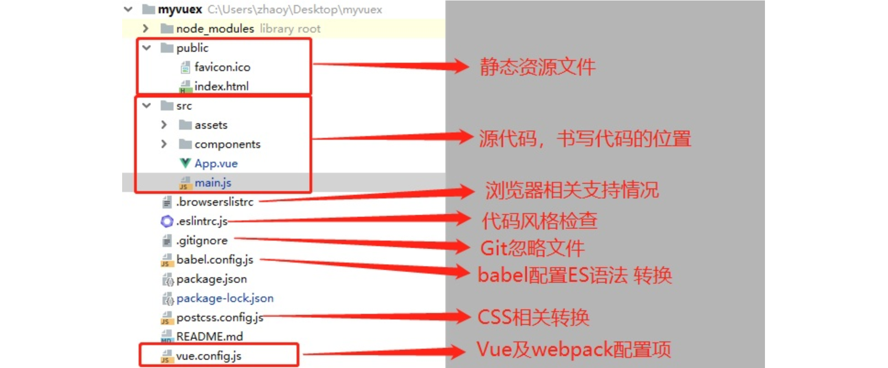

```js
node_modules
public // 静态资源文件
    |-favicon.ico
    |-index.html
src // 项目源代码，书写代码的地方
    |-assets
    |-App.vue
    |-main.js
.browserslistrc    // 浏览器相关支持情况
.eslintrc.js       // 代码相关支持情况
.gitignore         // Git忽略文件
babel.config.js    // babel配置ES语法 转换
package-lock.json  // npm安装依赖库的具体信息
package.json       // npm依赖库版本信息
postcss.config.js  // css相关转换
README.md          // 项目说明
vue.config.js      // Vue及webpack配置项
```

### 3.4 vue.config.js

`vue.config.js` 是一个可选的配置文件，如果项目的 (和 `package.json` 同级的) 根目录中存在这个文件，那么它会被 `@vue/cli-service` 自动加载。你也可以使用 `package.json` 中的 `vue` 字段，但是注意这种写法需要你严格遵照 JSON 的格式来写。

这个文件应该导出一个包含了选项的对象：

```js
// vue.config.js
module.exports = {
  // 选项...(例如：)
  lintOnSave: false	// 关闭eslint
}
```


脚手架中父子传值。


## 其他：（了解）

### 1. VsCode用户片段提供

请在VScode中设置如下代码片段，以用于后面每一个案例的创建

```json
{
	"demo": {
	  "prefix": "vue",
	  "body": [
		"<template>",
		"\t<div>",
		"\t\t$0",
		"\t</div>",
		"</template>",
		"",
		"<script>",
		"export default {",
		"\tdata () {",
		"\t\treturn {\n",
		" ",
		"\t\t}",
		"\t}",
		"}",
		"</script>",
		" ",
		"<style lang = \"less\" scoped>",
		"\t",
		"</style>"
	  ],
	  "description": "自定义的一个vue代码段"
	}
  }
```

### 2.“@/”路径提示配置

安装 Path Intellisense插件

打开设置 - 首选项 - 搜索 `Path Intellisense` - 打开 `settings.json` ，添加：

```json
"path-intellisense.mappings": {
     "@": "${workspaceRoot}/src"
 }
```

在项目 `package.json` 所在同级目录下创建文件 `jsconfig.json`：

```json
{
    "compilerOptions": {
        "target": "ES6",
        "module": "commonjs",
        "allowSyntheticDefaultImports": true,
        "baseUrl": "./",
        "paths": {
          "@/*": ["src/*"]
        }
    },
    "exclude": [
        "node_modules"
    ]
}
```

最后**重启打开**即可

### 3. vscode-vue插件安装

