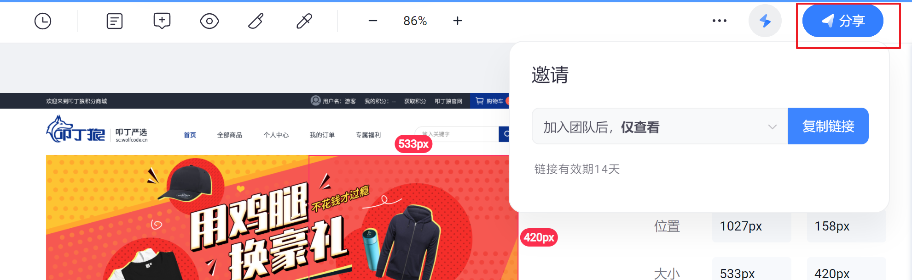
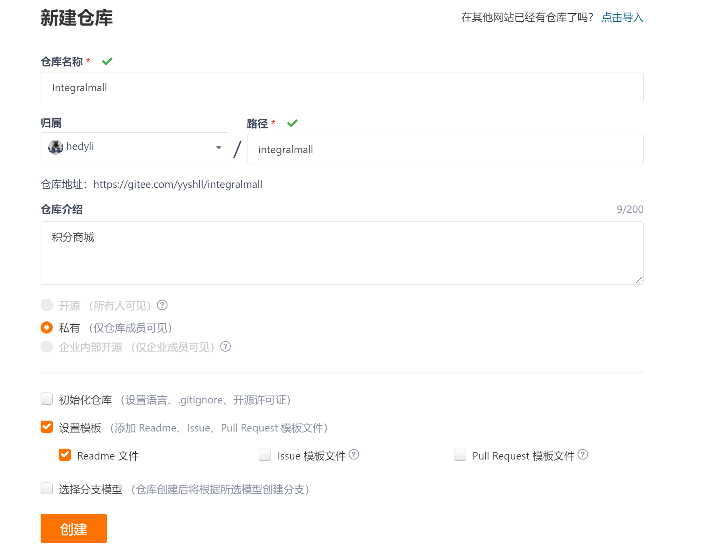
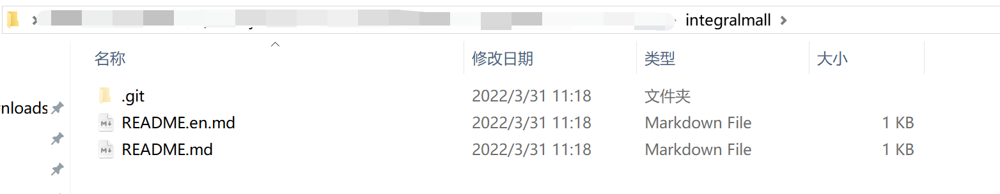
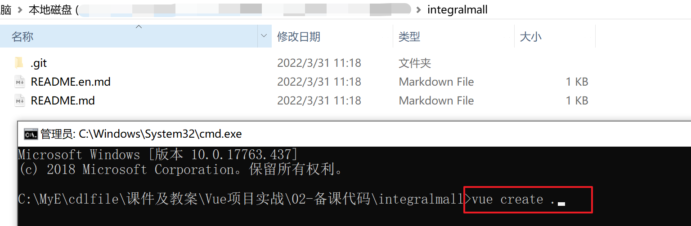
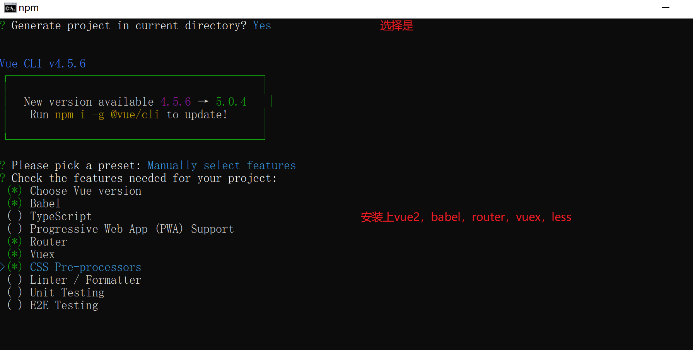
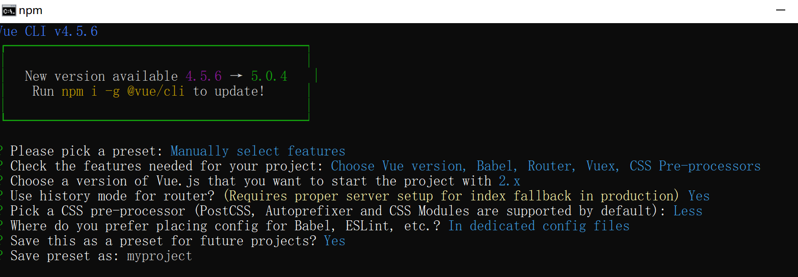
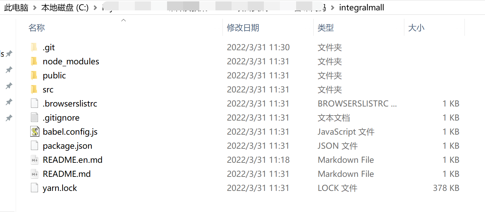
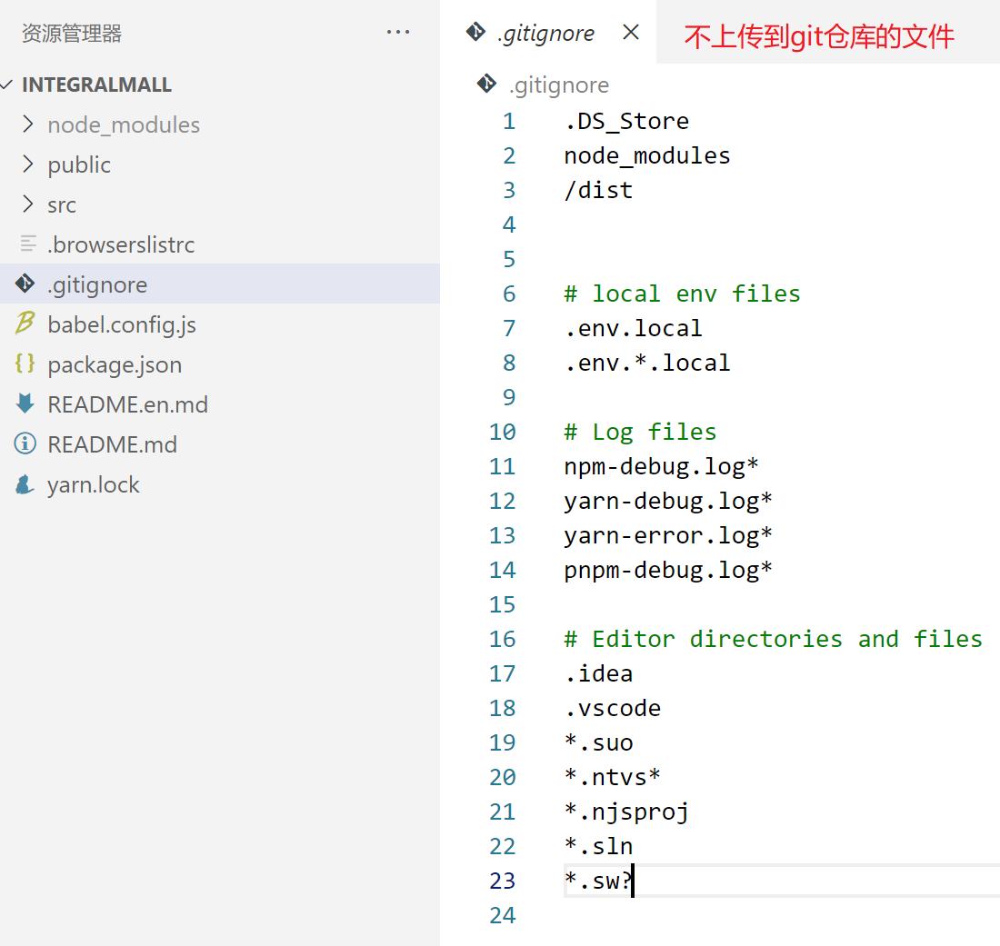
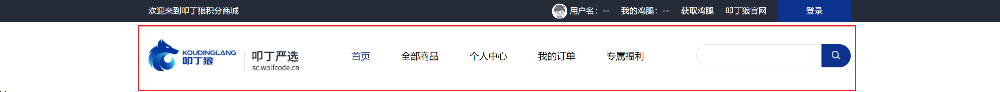

# 项目第一天

项目参照地址：http://kumanxuan1.f3322.net:8360/static/store-pc/index.html

* 项目备份地址：http://codesohigh.com/store-pc/home

真实项目参考地址：http://sc.wolfcode.cn/ 

* 接口文档地址：http://www.docway.net/project/1h9xcTeAZzV/share/1iUU09vKhMm

axios官网网址：http://www.axios-js.com/

>本节要点：
>
>1. 蓝湖的基本使用    (先有新版ps+蓝湖插件,网站:新建团队,新建项目,ps:将设计稿上传到对应项目即可)
>2. 项目远程仓库的创建  -  clone 
>3. 创建vue项目（删除不必要文件、样式初始化） vue create .  -- >
>4. 项目-网站结构布置 (topbar , header, 内容router-view,footer)
>5. 项目-数据请求axios封装
>6. 项目-头部组件
>7. 项目-导航组件
>8. 项目-导航切换（路由配置）

## 零、准备工作

1. 【安装】下载并安装ps2021 （选） 

2. 【注册】注册蓝狐账号 https://sso.lanhuapp.com/#/main/home

3. 【安装】下载并安装蓝狐插件 （需先有ps）

4. 【上传】上传psd文件至蓝湖项目中

5. 【分享】分享给未安装ps的同学


## 一、创建远程仓库 


## 二、复制SSH地址本地克隆

> 注意:个人电脑，一般配置一次SSH就可以了，不用每次都配置SSH

```git
git clone 项目ssh地址
```

克隆成功后如下图：



## 三、创建vue项目

### 创建项目 

cmd  - >  vue create.
 
 
 

### vscode打开项目 
cmd  - > code .
 

## 四、项目远程推送

### 推送

```cmd
git add --all
git commit -m '创建vue项目'
git push origin master
```


git remote show origin

### .gitignore文件

 

## 五、删除项目不必要文件

- `views` 下面的文件只保留 `Home.vue` ，其余删除，删除 `components/HelloWorld.vue`，并且 `Home.vue` 中不再引入 `HelloWorld` 组件。
- 删除 `src/assets` 下的图片，换成我们的img文件夹。
- 将 `router/index.js` 中 `about` 的路由注释掉。
- 删除 `App.vue` 中的less。

## 六、样式初始化

常见样式：normalize.css , 	reset.css

开始书写结构样式，在App.vue组件中：

```html
<div class="header"></div>

</script>
<style lang="less" scoped>
.header{
  height: 50px;
  background-color: #333;
}
</style>
```

发现页面会有自带的间距，这是浏览器本身的默认样式，所以我们需要进行样式初始化，清除浏览器默认样式。

安装初始化样式库reset-css：

```shell
npm i reset-css 或者   yarn add reset-css
```

安装成功后在main.js中引入即可：

```js
import "reset-css"
```

## 七、网站结构布置

在App.vue中设置好头部，导航和尾部组件:

```vue
<template>
  <div id="app">
        <Topbar></Topbar>
        <Header></Header>
        <router-view/>
        <Footer></Footer>
  </div>
</template>
<script>
import Header from '@/components/Header'
import Topbar from '@/components/Topbar'
import Footer from '@/components/Footer'

export default {
    components:{
        Header,Topbar,Footer
    },
   
}
</script>
```

在@/components目录下新建Header，Tabbar，Footer三个组件即可

## 八、网站数据请求模块

接口文档地址：http://www.docway.net/project/1h9xcTeAZzV/share/1iUU09vKhMm

接口地址：http://192.168.113.249:8081/cms

 *baseURL备用地址(不在广州校区内网的，请统一使用这个地址)：http://kumanxuan1.f3322.net:8881/cms* 

### 8.1 发起请求

作为一个网站前端，数据请求模块少不了。我们需要安装axios模块：

```shell
npm i axios@0.24.0
```

尝试在app.vue中做数据请求:

```js
import axios from "axios"
export default {
  	...
   created(){
    axios.get("http://192.168.113.249:8081/cms/products/recommend")
    .then(res=>{
      	console.log(res.data);
    })
    .catch(err=>{
      	console.log(err);
    })
},
}
```

> 项目中一般不会单个组件中引入。
>
> 1. 地址每次都是很长一段，一旦后续修改，改动地方也会增多 （接口管理）  request->request.js
> 2. 每次都需要设置请求头携带token （请求头）
> 3. 请求a完成后再请求b出现回调地狱  （回调地狱）

### 8.2 API与Request封装

在 `src` 下新建 `request`目录 ，在`request`目录下新建 `request.js` 

`request.js` 中：

```js
import axios from "axios"

const instance = axios.create({
    baseURL:"http://192.168.113.249:8081/cms",
    timeout:5000
})

instance.interceptors.request.use(config=>{
    console.log("每一次发起请求前，都会先执行这里的代码");
    console.log(config); //config本次请求的配置信息
    return config;
},err=>{
    return Promise.reject(err)
})

instance.interceptors.response.use(res=>{
    console.log("每一次接收到响应，都会先执行这里的代码，再去执行成功的那个回调函数then");
    return res.data;
},err=>{
    return Promise.reject(err)
})

export default instance
```

为了更好地管理我们的这些接口，我们把所有请求都抽取出来在一个api.js中

`在`request`目录下新建 `api.js，` api.js` 中：

```js
import request from './request'

// 请求精品推荐数据
export const JingpinAPI = () => request.get('/products/recommend')
```

### 8.3发起请求

App.vue

```js
import {JingpinAPI} from "@/request/api"
//写法一
created(){
    JingpinAPI()
        .then(res=>{
            if(res.errno == 0){
                console.log(res.data)	// 成功拿到所有首页数据
            }
        })
}

//写法二 解决回调地狱
async created(){
   //await Promise对象
   let res = await JingpinAPI() ;
   console.log(res);
}
```


### 8.4代理配置 (待定.)

我们对 `vue.config.js` 进行配置：

```js
module.exports = {
    devServer: {
        port: 8080,
        proxy: {
            '/api': {
                target: "http://192.168.113.249:8081/cms",
                pathRewrite: {
                    '^/api': ''
                }
            }
        }
    }
}
```

<font color="red">由于配置文件修改了，这里一定要记得重新 `yarn serve` ！！</font>

## 九、头部组件

### 9.1 版心样式

在assets在新建css目录，新建public.less文件

```less
.wrap{
    width: 1200px;
    margin: 0 auto;
}
```

在main.js中全局引入

```less
import "@/assets/css/public.less"
```

> scoped:样式只在当前组件中生效

### 9.2 头部组件布局

```vue
<template>
  <div class="topbar">
    <div class="wrap topbarWrap">
      <div class="l">欢迎来到叩丁狼积分商城</div>
      <ul class="r">
        <li>
          
          用户名：--
        </li>
        <li>我的鸡腿：--</li>
        <li>获取鸡腿</li>
        <li>叩丁狼官网</li>
        <li class="login-btn">登录</li>
      </ul>
    </div>
  </div>
</template> 

<style lang="less" scoped>
.topbar {
  height: 40px;
  line-height: 40px;
  background: #242b39;
  font-size: 14px;
  .topbarWrap {
    color: #fffefe;
    display: flex;
    justify-content: space-between;
    .r {
      li {
        float: left;
        margin-left: 20px;
        text-align: center;
        cursor: pointer;
        &.login-btn {
          width: 124px;
          height: 40px;
          background: #0a328e;
        }
      }
      .avatar {
        vertical-align: middle;
        border-radius: 50%;  
      }
    }
  }
}
</style>
```

## 十、导航组件



### 10.1 基本布局

header.vue

```vue
<template>
  <div class="headerWrap wrap">
    <h1 class="logobox">
      
    </h1>
    <ul class="navbox">
      <li class="current">首页</li>
      <li>全部商品</li>
      <li>个人中心</li>
      <li>我的订单</li>
      <li>专属福利</li>
    </ul>
    <div class="searchbox">
      <input type="text" />
      <span
        ></span>
    </div>
  </div>
</template>

<script>
export default {};
</script>

<style lang = "less" scoped>
.headerWrap {
  height: 118px;
  display: flex;
  justify-content: space-between;
  align-items: center;
  font-size: 16px;
  font-weight: 500;
  cursor: pointer;
  .navbox {
    width: 500px;
    display: flex;
    justify-content: space-between;
    .current {
      color: #0a328e;
    }
  } 
}
</style>
```

### 10.2 搜索框布局

```css
  .searchbox {
    display: flex; 
    input {
      width: 214px;
      height: 40px;
      border: 1px solid #dedede;
      border-radius: 20px 0 0 20px;
      box-sizing: border-box;
      padding-left: 19px;
      outline-style: none;
    }
    span {
      width: 50px;
      height: 40px;
      background: #0a328e;
      border-radius: 0px 20px 20px 0px;
      text-align: center;
      line-height: 40px;
    }
    .search-btn {
      width: 15px;
      height: 15px;
    }
  }
```


## 十一、路由配置及导航项当前样式

* 首页：home

* 全部商品：goods

* 个人中心：user

* 我的订单：order

* 专属福利：free

router->index.js

```js
const routes = [
  {
    path: '/',
    redirect: Home
  },{
    path: '/home',
    name: 'Home',
    component: Home
  }, {
    path: '/goods',
    name: 'Goods',
    component: () => import('../views/Goods.vue')
  },
  {
    path: '/user',
    name: 'User',
    component: () => import('../views/User.vue')
  },
  {
    path: '/order',
    name: 'Order',
    component: () => import('../views/Order.vue')
  },
  {
    path: '/free',
    name: 'Free',
    component: () => import('../views/Free.vue')
  }
]
```

在View目录中新建对应组件。

处理导航项当前样式，在Header.vue中

```html
    <ul class="navbox">
      <li @click="$router.push('/home')"  :class="{current:$route.path==='/home'}">首页</li>
      <li @click="$router.push('/goods')" :class="{current:$route.path==='/goods'}">全部商品</li>
      <li @click="$router.push('/user')"  :class="{current:$route.path==='/user'}">个人中心</li>
      <li @click="$router.push('/order')" :class="{current:$route.path==='/order'}">我的订单</li>
      <li @click="$router.push('/free')"  :class="{current:$route.path==='/free'}">专属福利</li>
    </ul>
```


<font color="red">温馨提示：一天完成啦，记得提交代码到仓库，需团队成员能拿到最新则提交到远程仓库。</font>

## 课后作业：

1. 完成课上内容
2. 完成底部组件
3. 完成首页产品展示组件