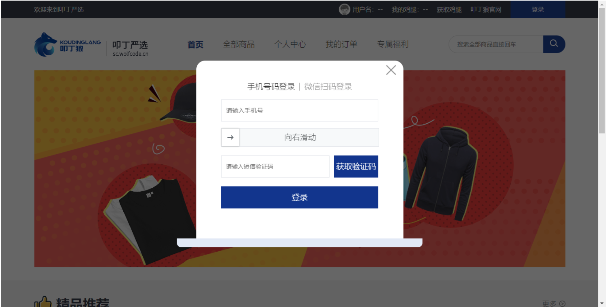
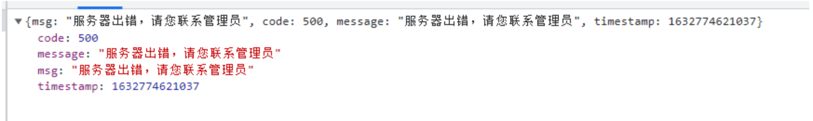
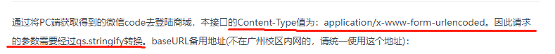
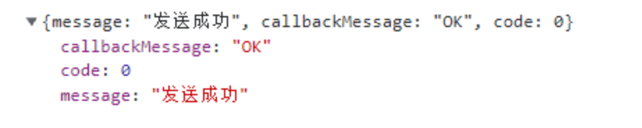
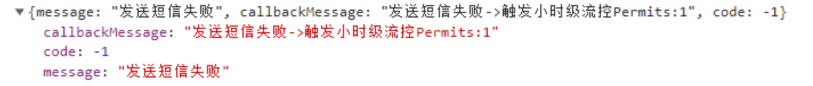

# 项目第二天

项目参照地址：http://kumanxuan1.f3322.net:8360/static/store-pc/index.html

项目备份地址：http://codesohigh.com/store-pc/home

接口文档地址：http://www.docway.net/project/1h9xcTeAZzV/share/1iUU09vKhMm

axios官网网址：http://www.axios-js.com/

> 本节要点：
>
> 0.day01 axios封装
>
> ​      npm i axios 
>
> ​      request->request.js (域名baseURL)  , api.js (接口统一管理)
>
> ​      拦截器(请求,响应)   统一携带token 
>
> ​      async + await 
>
> 导航切换, 头部topbar,header  [flex,浮动]
>
> 1. 登录-登录模态框布局及切换效果    Login.vue , Vuex存储登录框是否显示状态
>
>    
>
> 2. 手机号登录-拼图验证滑块
>
>    （1.阅读文档，2.下插件 3. 根据文档使用组件 4.结合项目自身需求进行修改。 /deep/）
>
> 3. 手机号登录-获取验证码
>
>    口述逻辑： 
>
>    1.输入手机号  （正则验证）
>
>    2.滑块验证码   （msg）
>
>    3.获取验证码 - 显示倒计时 （给后台发起一个请求 ，循环setInterval(()=>{count--},1000)递减数字count）


axios (拦截器 请求拦截，响应拦截)

api.js

axios.get()

axios.post()

发请求 ：  请求拦截器（token) - 响应拦截器(二次处理-统一提示错误信息) - 服务器返回结果。

## 一、登录模块布局

### 1.1、模态窗口的书写

点击登录按钮，弹出模态窗口，如下图：



我们在components目录下新建一个Login.vue组件

```vue
<template>
  <div class="modal">
    <div class="mask"></div>
    <div class="loginBox"></div>
  </div>
</template>
<style lang="less" scoped>
.modal {
  width: 100%;
  height: 100%;
  position: fixed;
  left: 0;
  top: 0; 
  .mask {
    width: 100%;
    height: 100%;
    background-color: rgba(0, 0, 0, 0.5);
  }
  .loginBox {
    position: absolute;
    top: 0;
    left: 0;
    right: 0;
    bottom: 0;
    margin: auto;
    width: 555px;
    height: 423px;
    background: url("../assets/img/login-box-bg.png");
  }
}
</style>
```

然后在App.vue组件中引入，注册，使用。

```vue
<template>
  <div id="app">
    <Topbar></Topbar>
    <Header></Header>
    <router-view />
    <Footer></Footer>
    <Login></Login>
  </div>
</template>
```

### 1.2、设置点击展示模态窗口

因为项目中可能有在各个组件中触发这个模态窗口的展示，所以控制模态框展示的变量可以放在Vuex中

在store中新建showModal目录，并在其中新建index.js：

```js
export default {
    namespaced:true,
    state:{
        isShowLoginModal:false //是否显示登录模态窗口
    },
    mutations:{
        changeIsShowLoginModal(state,payload){
            state.isShowLoginModal = payload;
        }
    },
    actions:{}
}
```

在store.js中引入：

```js
import Vue from 'vue'
import Vuex from 'vuex'
import showModal from './showModal'
Vue.use(Vuex)
export default new Vuex.Store({
  ...
  modules: {
    showModal
  }
})

```

Login.vue组件中：

```vue
<template>
  <div class="modal" v-show="isShowLoginModal"> 
    <div class="mask"></div>
    <div class="loginBox"></div>
  </div>
</template>

<script>
import {mapState} from 'vuex'
export default {
    computed:{
        ...mapState({
            isShowLoginModal:state=>state.showModal.isShowLoginModal
        })
    }
};
</script>
```

TopBar.vue组件中:

```vue
<li class="login-btn" @click="changeIsShowLoginModal(true)">登录</li>

<script>
import {mapMutations} from 'vuex'
export default {
  methods:{
    ...mapMutations({
      changeIsShowLoginModal:"showModal/changeIsShowLoginModal"
    })
  }
};
</script>
```

### 1.3、点击关闭模态窗口

Login.vue中：

```vue
<template>
  <div class="modal" v-show="isShowLoginModal">
    <div class="mask" @click="changeIsShowLoginModal(false)"></div>
    <div class="loginBox">
      <div class="close" @click="changeIsShowLoginModal(false)"></div>
    </div>
  </div>
</template>
<script>
import { mapState, mapMutations } from "vuex";
export default {
  ...
  methods: {
    ...mapMutations({
      changeIsShowLoginModal: "showModal/changeIsShowLoginModal",
    }),
  },
};
</script>
 
<style lang="less" scoped>
.modal {
  ...
  .loginBox {
    ...
    .close {
      position: absolute;
      right: 60px;
      top: 16px;
      height: 22px;
      width: 22px;
      background: url("../assets/img/close.png");
    }
  }
}
</style>
```

> 目前完成效果：实现模态框的显示隐藏效果

### 1.4、点击标题栏的切换效果

Login.vue中：

```vue
 <div class="loginBox">
      <div class="close" @click="changeIsShowLoginModal(false)"></div>
      <section class="nav">
        <a href="#" :class="{active:isShowContent}" @click="isShowContent=true">手机号码登录</a> |
        <a href="#" :class="{active:!isShowContent}" @click="isShowContent=false">微信扫码登录</a>
      </section>
      <div class="content">
        <!-- 手机号码登录 -->
        <div class="phoneLogin" v-show="isShowContent">手机号码登录</div>
        <!-- 微信二维码登录 -->
        <div class="qrLogin" v-show="!isShowContent">微信二维码登录</div>
      </div>
    </div>

<script> 
export default {
  data() {
    return {
      isShowContent: true,
    };
  }
};
</script>

<style lang="less" scoped>
.modal {
  ...
  .loginBox {  
    .nav {
      display: flex;
      justify-content: center;
      font-size: 20px;
      padding-top: 50px;
      a {
        padding: 0 10px;
        color: #999;
        text-decoration: none;
        &.active {
          color: #333;
        }
      }
    }
    .content {
      border: 1px solid red;
      margin-top: 20px;
    }
  }
}
</style>
```

### 1.5、表单基本布局

Login.vue中：

```vue
<template>
    ...
      <div class="content">
        <!-- 手机号码登录 -->
        <div class="phoneLogin" v-show="isShowContent">
            <div class="row">
                <input type="text" class="ipt" placeholder="请输入手机号">
            </div>
            <div class="row">
                <input type="text" class="ipt" placeholder="向右滑动">
            </div>
            <div class="row">
                <input type="text" class="ipt" placeholder="请输入短信验证码">
                <button class="btnCode">获取验证码</button>
            </div>
            <div class="row">
                <button class="btnLogin">登录</button>
            </div>
        </div>
        <!-- 微信二维码登录 -->
        <div class="qrLogin" v-show="!isShowContent">微信二维码登录</div>
      </div> 
</template>      
<style lang="less" scoped>
.modal { 
  .loginBox { 
   ...
    .content { 
      width: 355px;
      margin: 20px auto 0;
      height: 200px;
      .phoneLogin{
          .row{
              display: flex;
              margin-bottom: 20px;
          }
          .ipt{
              box-shadow: 0;
              flex: 1;
              height: 48px;
          }
        .btn {
          color: #fff;
          background-color: #0a328e;
          border: none;
          cursor: pointer;
        }
        .btnCode {
          margin-left: 10px;
          line-height: 50px;
          width: 100px;
          text-align: center;
        }
        .btnLogin {
          width: 100%;
          height: 50px;
          line-height: 50px;
        }
      }
    }
  }
}
</style>
```

## 二、拼图验证滑块

 插件参考：https://gitee.com/monoplasty/vue-monoplasty-slide-verify 

### 2.1、安装插件

```shell
npm install --save vue-monoplasty-slide-verify
或者
yarn add vue-monoplasty-slide-verify
```

### 2.2、main.js入口文件引中入

```js
import SlideVerify from 'vue-monoplasty-slide-verify' // 拼图验证码
Vue.use(SlideVerify)
```

### 2.3、在组件中使用

```vue
<template>
	<slide-verify :l="42" :r="20" :w="362" :h="140" @success="onSuccess" @fail="onFail" @refresh="onRefresh" :style="{ width: '100%' }" class="slide-box" ref="slideBlock" :slider-text="msg"></slide-verify>
</template>

<script>
export default {
  data() {
    return {
      msg: "向右滑动"
    };
  },
  methods: {
    // 拼图成功
    onSuccess(times) {
      let ms = (times / 1000).toFixed(1);
      this.msg = "login success, 耗时 " + ms + "s";
    },
    // 拼图失败
    onFail() {
      this.onRefresh(); // 重新刷新拼图
    },
    // 拼图刷新
    onRefresh() {
      this.msg = "再试一次";
    },
  },
};
</script>

<style lang="less" scoped>
/deep/.slide-box {
    width: 100%;
    position: relative;
    box-sizing: border-box;
    canvas {
        position: absolute;
        left: 0;
        top: -120px;
        display: none;
        width: 100%;
        box-sizing: border-box;
    }
    .slide-verify-block{
        width: 85px;
        height: 136px;
    }
    .slide-verify-refresh-icon {
        top: -120px;
        display: none;
    }
    &:hover {
        canvas {
            display: block;
        }
        .slide-verify-refresh-icon {
            display: block;
        }
    }
}
</style>
```

### 2.4、点击登录按钮，判断是否有进行拼图滑块验证

登录之前，我们需要验证用户是否有拼图验证过，有拼图验证过才可以登录。

我们以msg文字内容来判断是否有进行拼图滑块验证

```js
<button class="btnLogin" @click="submitFn">登录</button>

<script> 
export default {
 ...
  methods: {
    ...
    submitFn() {
      // 以msg文字内容来判断是否有进行拼图滑块验证
      if (this.msg == "再试一次" || this.msg == "向右滑动") {
        alert("请滑动拼图");
        return;
      }
      alert("拼图滑块验证通过，可以执行登录了");
    },
  },
};
</script>
```

## 三、点击获取验证码按钮的逻辑

### 3.1、逻辑分析

可以正常获取验证码的前提是：手机号格式正确

所以，点击获取验证码的逻辑如下：

1、如果校验手机号格式不正确，则return

2、滑块拼图验证不通过，则return

3、验证成功后，发起请求，获取验证码成功，则进行倒计时

【百度】结合运营商之后的手机号码的正则：

```js
/^(13[0-9]|14[01456879]|15[0-35-9]|16[2567]|17[0-8]|18[0-9]|19[0-35-9])\d{8}$/
```

### 3.2、点击获取验证码判断手机号格式

```vue
<button class="btnCode" @click="getCode">获取验证码</button>

<script> 
export default {
 ...
  methods: {
    ...
    getCode() {
      // 1、如果校验手机号格式不正确，则return
      let reg =
        /^(13[0-9]|14[01456879]|15[0-35-9]|16[2567]|17[0-8]|18[0-9]|19[0-35-9])\d{8}$/;
      if (!reg.test(this.phoneNumber)) {
        alert("请输入正确的手机号");
        this.$refs.phone.focus();
        return;
      }
      // 2、滑块拼图验证不通过，则return
      if (this.msg == "再试一次" || this.msg == "向右滑动") {
        alert("请先进行滑块验证");
        return;
      }
      // 3、验证成功后，发起请求，获取验证码成功，则进行倒计时
    },
  },
};
</script>
```

### 3.3、倒计时及其展示

```vue
<div class="btn btnCode" :class="{hasCount:isShowCount}" @click="getCode" >
     <span v-show="!isShowCount">获取验证码</span>
     <span v-show="isShowCount">{{ count }} s</span>
</div>
            
<script> 
export default {
  data() {
    return {
      isShowContent: true,  //是否显示内容
      msg: "",              //验证码提示消息
      phoneNumber: "",      //手机号
      count: 60,            //计数值
      isShowCount: false,   //是否显示倒计时
    };
  },
  methods: {
    ...
    countdown(){ 
        let timer = null;
        timer = setInterval(() => {
            this.count--;
            if(this.count==0){
                clearInterval(timer);
                this.isShowCount = false;
                this.count = 60;
            }
        },1000);
    },
    getCode() {
      // 1、如果校验手机号格式不正确，则return
      ...
      // 2、滑块拼图验证不通过，则return
      if (this.msg == "再试一次" || this.msg == "向右滑动") {
        alert("请先进行滑块验证");
        return;
      }
      // 3、验证成功后，发起请求，获取验证码成功，则进行倒计时 
      this.countdown();
      this.isShowCount = true;
    },
  },
};
</script>            
```

### 3.4、连续点击倒计时bug

此时连续点击倒计时会有bug，数字越跳越快，主要是重复开启倒计时造成的。

其实我们只需要把事件给到 "获取验证码" 所在的span，就可以解决

```html
<div class="btn btnCode" :class="{hasCount:isShowCount}"  >
    <span v-show="!isShowCount" @click="getCode">获取验证码</span>
    <span v-show="isShowCount">{{ count }} s</span>
</div>
```

### 3.5、抽取工具函数(优化)

事实上，验证手机号本身是一个工具函数，和本身逻辑有关但是具体代码不需要在组件中体现。真实项目场景往往是放在工具函数的文件中。

src目录下新建utils文件夹，在里面新建index.js文件：

```js
export const validateTelephoneNumber = value =>{
    let reg = /^(13[0-9]|14[01456879]|15[0-35-9]|16[2567]|17[0-8]|18[0-9]|19[0-35-9])\d{8}$/
    return reg.test(value)
}
```

在Login.vue组件中：

```js
import {validateTelephoneNumber} from "@/utils"
...
getCode(){
    // 1、验证手机号是否正确
    if(!validateTelephoneNumber(this.phoneNum)){
        alert("请输入正确的手机号");
        this.$refs.phone.focus();
        return
    }
    // 2、进行滑块验证
     	...      
    // 3、验证成功后，发起请求，获取验证码成功，则进行倒计时，并展示秒数
    	...

},
```

### 3.6、发起获取验证码请求

接口： /sendSMS 

api.js文件中

```js
// 发送短信验证码请求
export const SendSMSAPI = params => request.post("/sendSMS",params);
```

Login.vue组件中：

```js
import 

// 3、验证成功后，发起请求，获取验证码成功，则进行倒计时，并展示秒数
SendSMSAPI({
    phone:this.phoneNum.trim()
}).then(res=>{
    this.countdown();
    this.isShowCount=true;
    console.log(res);
})
```

发现返回的数据报如下错误：



其实接口上有需要我们修改请求头Content-Type字段，并使用qs.stringnify进行格式转换：



所以我们需要在请求拦截器加上：request.js

```js
instance.interceptors.request.use(config=>{
    if (config.url === "/sendSMS" || config.url === "/wechatUsers/PCLogin") {
        config.headers["Content-Type"] = "application/x-www-form-urlencoded";
    }
    return config
},err=>{
    return Promise.reject(err)
})
```

并且安装qs模块： 

```
npm i qs
```

api.js中：

```js
import qs from "qs"
// 发送短信验证码请求
export const SendSMSAPI = params => request.post("/sendSMS",qs.stringify(params));
```

再次到浏览器进行测试

看见如下响应则为发送成功。



后端对每一个手机号做了限制，如果看到如下图，说明已经达到最大可发送短信条数，请隔数个小时后再尝试：




### 3.7、请求成功回调函数的完善

Login.vue

```js
// 3、验证成功后，发起请求，获取验证码成功，则进行倒计时，并展示秒数
SendSMSAPI({
    phone:this.phoneNum.trim()
}).then(res=>{
    if(res.code===0){
        this.countdown();
        this.isShowCount=true;
        console.log(res);    
    }else{
        //获取短信验证码失败
        alert(res.message)
    }
}).catch(err=>{
    // 发送请求失败
    alert("请重新发送")
})
```
写法二：
```js
    async getSMScode(){ 
      ...
      // 3 发送短信验证码---就是一个请求, 把倒计时显示出来  
      let res = await SendSMSAPI({
        phone:this.phoneNum.trim(),
      });

      if(res.code==0){
          alert("短信验证码发送成功!")
          // 成功执行这里的代码
          // 显示倒计时
          this.isShowCount=true;
          // 进行倒计时
          this.countDown();
      }else{
          //失败时提示
          alert(res.message)
      }
    },
```

### 3.8、统一处理code不为0的情况

request->request.js

```js
// 封装响应拦截器
instance.interceptors.response.use(response=>{  
    // 对响应数据做点什么 
    // 统一处理响应码不为0 的情况
    let response = res.data 
    if(res_data.code!=0){
         // 业务失败时候提示用户有问题
         alert(response.message)
         return false
    }
    return res_data // 这里的数据 return 到组件内部请求的回调函数中的res
},err=>{     
    // 直接抛出这个异常
    return Promise.reject(err)
})
```

Login.vue

```js
 async getSMScode(){ 
      ...
      // 3 发送短信验证码---就是一个请求, 把倒计时显示出来  
      let res = await SendSMSAPI({
        phone:this.phoneNum.trim(),
      });
     if(!res)return;
     alert("短信验证码发送成功!")
     // 成功执行这里的代码
     // 显示倒计时
     this.isShowCount=true;
     // 进行倒计时
     this.countDown();
   },
```

