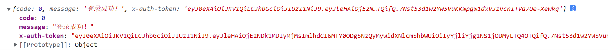
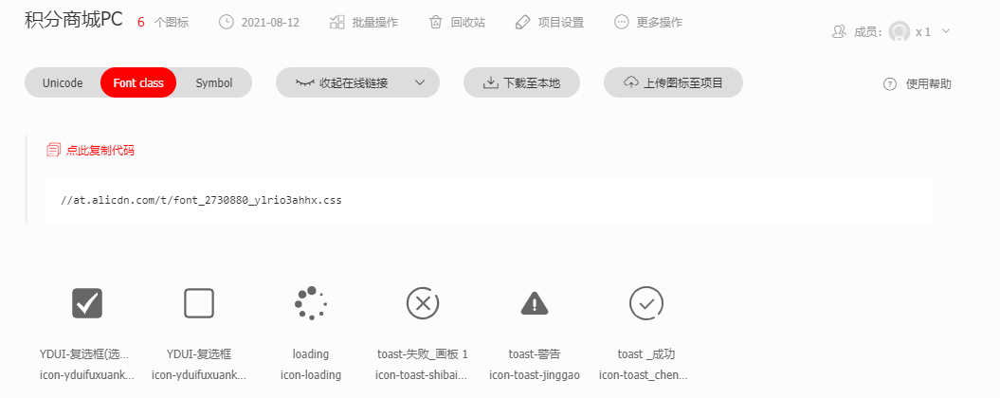
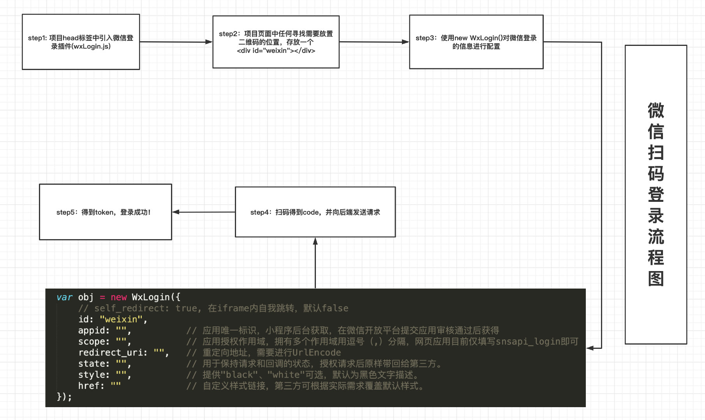

# Vue积分商城项目

项目参照地址：http://kumanxuan1.f3322.net:8360/static/store-pc/index.html

项目备用地址：http://codesohigh.com/store-pc/home

接口文档地址：http://www.docway.net/project/1h9xcTeAZzV/share/1iUU09vKhMm

axios官网网址：http://www.axios-js.com/

> 本节要点：
>
> 1. 登录成功后购物车切换
>
>    保存token值 存localStorage
>
>    vuex中存储是否登录isLogined的状态  ，默认等于本地是否存在
>
> 2. Toast提示组件封装
>
>    目的:复用,任何需要提示的地方   不确定: 显示隐藏,提示内容,图标显示
>
>    2.1 创建了一个Toast组件 实现基本布局  (components->Toast)
>
>    2.2 将不确定的数据存储在了vuex的state中,进行管理  并且组件中可修改 (mutations,actions)   store->xxx->index.js
>
>    2.3 使用vue 的transition组件增加过渡效果  (调用 App.vue )
>
>    2.4 实现自动关闭功能,在actions中增加了定时器自动关闭. store->xxx->index.js
>
> 3. 微信登录二维码获取
>
>    3.1 html文件内hader中引入插件
>
>    3.2 提供一个显示二维码容器 #weixin
>
>    3.3 通过new WeiXinLogin({配置...})   显示二维码
>
>    3.4 调整样式   先编写css,转换为base64,将地址复制到 href属性中.


## 一、手机号码登录逻辑分析

手机号码登录逻辑分析：

1、手机号码格式是否正确

2、拼图滑块验证通过

3、验证码是否为空（注意，这里我们前端并没有拿到发送的手机验证码，所以只能判空）

4、发起登录请求


### 1.1、抽取前两个验证的代码

前两个验证我们前面已经做了，可以直接封装成函数

Login.vue中：

```js
		toVerify(){
            // 1、验证手机号是否正确
            if(!validateTelephoneNumber(this.phoneNum)){
                alert("请输入正确的手机号");
                this.$refs.phone.focus();
                return
            }

            // 2、进行滑块验证
            if (this.msg == "再试一次" || this.msg == "向右滑动") {
                alert("请先进行滑块验证");
                return 
            }
        },
        getCode(){
            this.toVerify();
        	//3、发起请求
            ...
        }
```

如果只是按照上面进行抽取，则会有验证不通过还发起请求的bug

所以，this.toVerify();应换成：

```js
		toVerify(){
            // 1、验证手机号是否正确
            if(!validateTelephoneNumber(this.phoneNum)){
                alert("请输入正确的手机号");
                this.$refs.phone.focus();
                return
            }

            // 2、进行滑块验证
            if (this.msg == "再试一次" || this.msg == "向右滑动") {
                alert("请先进行滑块验证");
                return 
            }
            // 【！！！！！！！！】
            return true
            // 【！！！！！！！！】
        },
        getCode(){
            if(!this.toVerify()){
                return
            };
        	//3、验证成功后，发起验证码请求
            ...
        },
       submitFn(){
             if(!this.toVerify()){
                return
            };
        	//3. 验证用户输入的验证码是不是为空 ，为空酒return 。
             //4. 发起登录请求   
      }    
```

### 1.2、发起登录请求

api.js中：

```js
// 手机号登录请求
export const PhoneLoginAPI = params => request.post("/phoneRegin",qs.stringify(params));
```

Login.vue中：

```js
import { SendSMSAPI, PhoneLoginAPI } from "@/request/api";
...
		// 点击登录按钮
        submitFn() {
            if(!this.toVerify()){
                return
            }; 
    
    		// 验证码是否为空
            if (this.code.trim() === "") {
                alert("请输入验证码再进行登录");
                return;
            }

            // 发起登录请求
            PhoneLoginAPI({
                // 先根据后端给到的测试账号和密码做登录。
                // 但如果真正场景要传的是短信验证码和手机号
                phone:"13800138001",
                password:"qwerty567"
            }).then(res=>{
                // 登录成功
                console.log(res);
                
            })
        },
```

看到下图就表示登录成功了。



### 1.3、登录成功后的逻辑

登录成功后，我们需要做什么？

1、提示登录成功

2、保存token值到localStorage

3、隐藏登录模态窗口

【！！！】4、登录状态的切换

所以在回调函数中：

```js
 			// 发起登录请求
            PhoneLoginAPI({
                phone:"13800138001",
                password:"qwerty567"
            }).then(res=>{
                if(res.code===0){
                    // 1、提示登录成功
                    alert("登录成功");

                    // 2、存储token
                    localStorage.setItem("x-auth-token", res["x-auth-token"]);
                    
                    // 3、隐藏登录模态窗口
                    this.chanIsShowLoginModal(false);
                    
                    // 【！！！】4、登录状态的切换
                }
                
             })
```

### 1.4、购物车按钮的布局

登陆之后的购物车按钮布局：

TopBar.vue文件中：

```vue
<li class="cart-btn"  v-if="isLogined">
   
   <span>购物车</span>
   <strong>{{ cartTotal }}</strong>
</li>
<script>
	data () {
        return {
            //购物车总数
            cartTotal:0,
        }
    },
</script>

<style>
      .cart-btn {
        width: 124px;
        height: 40px;
        background: #0a328e;
        text-align: center; 
        img{
          width: 20px;
          height: 19px;
          vertical-align: middle;
        }
        span{
          margin: 0 8px;
        }
        strong{
          width: 22px;
          height: 22px;
          line-height: 22px;
          display: inline-block;
          border-radius: 50%;
          background-color: #fd604d;
        }
      }
</style>
```

### 1.5、购物车按钮展示（登录状态）分析

因为该购物车按钮需要依靠 **有没有登录这个状态的值** 来进行展示，并且，这个值会在Login.vue这个文件中进行修改，所以，我们把有没有登录这个状态值放在Vuex中:

store目录中新建文件夹loginStatus，中新建index.js：

```js
export default{
    namespaced:true,
    state: {
        isLogined:localStorage.getItem("x-auth-token")?true:false  // 用来表示是否登录的登录状态值
    },
    mutations: {
        chanIsLogined(state,payload){
            console.log("执行了chanIsLogined");
            state.isLogined = payload
        }
    },
    actions: {
        
    },
}
```

记得在store/index.js中引入。

在TopBar.vue中

```vue
<div class="cart_btn" v-if="isLogined">
    
    <span>购物车</span>
    <b>{{cartTotal}}</b>
</div>
<li class="login-btn" v-else @click="chanIsShowLoginModal(true)">登录</li>

...
<script>
    import {mapMutations,mapState} from "vuex"
    
    ...
	computed:{
        ...mapState({
            isLogined:state=>state.loginStatus.isLogined
        })
        
    },
</script>
```

最后在登录的回调函数中进行修改这个值。即在Login.vue中：

```js
	...mapMutations({
            chanIsShowLoginModal:"showModal/chanIsShowLoginModal",
            chanIsLogined:"loginStatus/chanIsLogined"
        }),
	...
    ...
	
			PhoneLoginAPI({
               ...
            }).then(res=>{
                if(res.code===0){
                    // 提示登录成功
                    ...
                    // 存储token
                    ...
                    // 隐藏登录模态窗口
                    ...
                    // 登录状态值的切换
                    this.chanIsLogined(true)
                }
                
             })
```


## 二、提示组件的封装

### 2.1、icon图标的使用

#### 2.1.1、在全局中引入

效果图中icon的链接：

https://at.alicdn.com/t/font_2730880_ylrio3ahhx.css

 

#### 2.1.2、具体图标名称

| 图标名称          | 图标类名                      |
| ----------------- | ----------------------------- |
| YDUI-复选框(选中) | icon-yduifuxuankuangxuanzhong |
| YDUI-复选框       | icon-yduifuxuankuang          |
| loading           | icon-loading                  |
| toast-失败_画板 1 | icon-toast-shibai_huaban      |
| toast-警告        | icon-toast-jinggao            |
| toast _成功       | icon-toast_chenggong          |

#### 2.1.3、在组件中使用

```html
<i class="iconfont icon-loading"></i>
```

### 2.2、Toast组件的初步封装与使用

https://at.alicdn.com/t/font_2730880_ylrio3ahhx.css

iconfont的样式链接内容粘贴到src/assets/css/public.less中，

components目录下新建Toast.vue

```vue
<template>
    <div class="toast">
        <i class="iconfont icon-toast-shibai_huaban"></i>
        <span>提示内容</span>
    </div>
</template>

<script>
export default {
    data () {
        return {

 
        }
    }
}
</script>
 
<style lang = "less" scoped>
.toast{
  position: fixed;
  padding: 10px 20px;
  display: flex;
  justify-content: center;
  align-items: center;
  background: #fff;
  left: 50%;
  top: 0;
  transform: translateX(-50%);
  border-radius: 10px;

  .iconfont{
    margin-right: 10px;
  }

  .icon-toast-shibai_huaban{
    color: red;
  }

  .icon-toast_chenggong{
    color: green;
  }

  .icon-toast-jinggao{
    color: orange;
  }
}
</style>
```

App.vue中引入注册使用即可 。

### 2.3、Toast组件展示

Toast组件展示与否最终可以在各个组件中调用，所以放在Vuex中。

然后在App中：

```vue
<Toast v-show="isShowToast"></Toast>
<script>
...
import {mapState} from "vuex"
export default {
   ...
    computed:{
        ...mapState({
            isShowToast:state=>state.showToast.isShowToast
        })
    }
}
</script>
```

接下来尝试写个事件看是否能触发显示和隐藏切换

在TopBar组件中，先找头像尝试点击触发展示：

```vue


<script>
    methods:{
        ...mapMutations({
            chanIsShowLoginModal:"showModal/chanIsShowLoginModal",
            chanIsShowToast:"showToast/chanIsShowToast"
        }),
        showToastFn(){
            this.chanIsShowToast(true)
        }
    }
</script>
```

### 2.4、Toast组件的进场离场效果

Vue提供了transition组件，配合css3可以用来做进场离场效果：https://cn.vuejs.org/v2/guide/transitions.html

App.vue中添加:

```css
<template>
  	<div id="app">
        <transition name="slide">
            <Toast v-show="isShowToast"></Toast>
        </transition>
        ...
        ...
        ...
   </div>
</template>
<style lang="less">
/* 入场的起始状态 = 离场的结束状态 */
.slide-enter, .slide-leave-to{
  opacity: 0;
}

.slide-enter-active, .slide-leave-active{
  transition: opacity .3s linear;
}

.slide-enter-to, .slide-leave{
  opacity: 1;
}
</style>
```

在TobBar.vue组件中：

```js
methods:{
    ...mapMutations({
        chanIsShowLoginModal:"showModal/chanIsShowLoginModal",
        chanIsShowToast:"showToast/chanIsShowToast"
    }),
    showToastFn(){
        this.chanIsShowToast(true);
        setTimeout(()=>{
            this.chanIsShowToast(false);
        },1500)
    }
}
```

记得把Toast组件中的opacity属性去掉

### 2.5、封装Toast的属性

一个完整的Toast组件最好需要有展示、颜色、类型三种属性：

在vuex中，补充：

```js
export default{
    namespaced:true,
    state: {
        // 表示是否展示提示
        isShowToast:false, 
        // toast的内容
        toastMsg: "默认内容",
        // toast的类型(success, danger, info)
        toastType: "success"
    },
    mutations: {
        chanIsShowToast(state,payload){
            console.log(payload);
            state.isShowToast = payload.isShow;
            if(payload.isShow){
                state.toastMsg = payload.msg;
                state.toastType = payload.type;
            } 
        }
    },
    actions: {
        
    },
}
```

Toast.vue组件：

> success :  iconfont icon-toast_chenggong
>
> warning :  iconfont icon-toast-jinggao
>
> danger  :  iconfont icon-toast-shibai_huaban

```vue
<template>
    <div class="toast">
        <!-- <i class="iconfont icon-toast-shibai_huaban"></i>
        <span>提示内容</span> -->
        <i 
      :class="toastType=='success' ? 'iconfont icon-toast_chenggong' : (toastType=='danger' ? 'iconfont icon-toast-shibai_huaban' : 'iconfont icon-toast-jinggao')"
    ></i>
    <span>{{toastMsg}}</span>
    </div>
</template>

<script>
import {mapState} from "vuex"
export default {
    data () {
        return {

 
        }
    },
    computed:{
        ...mapState({
            toastMsg:state=>state.showToast.toastMsg,
            toastType:state=>state.showToast.toastType,
        })
    }
}
</script>
```

最后在TopBar.vue组件中，调用的时候传入对象：

```js
	showToastFn(){
        this.chanIsShowToast({
            isShow:true,
            msg:"请先登录",
            type:"danger"
        });
        setTimeout(()=>{
            this.chanIsShowToast({
                isShow:false,
            });
        },1500)
    }
```
### 2.6、Toast组件自动关闭的处理

Toast组件应该具备自动关闭的功能，而不是每次调用都要写一段定时器代码来关闭。

即TopBar.vue组件中去掉setTimeout方法，在TopBar.vue中:

```js
	import {mapMutations,mapState,mapActions} from "vuex"

	methods:{
        ...mapMutations({
            chanIsShowLoginModal:"showModal/chanIsShowLoginModal"
        }),
        ...mapActions({
            asyncIsShowToast:"showToast/asyncIsShowToast"
        }),
        showToastFn(){
            this.asyncIsShowToast({
                isShow:true,
                msg:"请先登录",
                type:"danger"
            });
            /* setTimeout(()=>{
                this.chanIsShowToast({
                    isShow:false,
                });
            },1500) */
        }
    }
```

在Vuex中书写actions：

```js
	actions: {
        asyncIsShowToast(context,payload){
            context.commit("changeIsShowToast",{
                isShow:true,
                msg:payload.msg,
                type:payload.type
            })
            setTimeout(()=>{
                context.commit("changeIsShowToast",{
                    isShow:false, 
                    msg:payload.msg,
                    type:payload.type
                })
            },1000) 
        }
    },
```

> 1.样式结构
>
> 2.显示因此百变量存储到vuex中
>
> 3.过渡效果（进场离场）
>
> 4.增加灵活性msg和type属性处理
>
> 5.使用定时器关闭Toast组件

## 三、微信登录二维码的获取与展示



### 3.1、获取微信二维码

在  public/ndex.html  的head标签中引入：

```html
<script src="https://res.wx.qq.com/connect/zh_CN/htmledition/js/wxLogin.js"></script>
```

把Login.vue文件中展示二维码图片的盒子上添加  id=“weixin”  ：

```html
<div id="weixin" class="qrcode" v-show="!isShowForm">
     二维码
</div>
```

修改点击“微信扫码登录”点击功能：

```vue
<a href="#" :class="{ active: !isShowContent }" @click="showQrCode" >微信扫码登录</a>
<script>      
    ...
    methods：{
      showQrCode() {
          isShowContent = false;
          //获取二维码 并展示
          // 申请微信登录二维码
          let _this = this;
          new WxLogin({
            id: "weixin",
            appid: "wx67cfaf9e3ad31a0d", // 这个appid要填死
            scope: "snsapi_login",
            // 扫码成功后重定向的接口
            redirect_uri: "https://sc.wolfcode.cn/cms/wechatUsers/shop/PC",
            // state填写编码后的url
            state: encodeURIComponent(
              window.btoa("http://127.0.0.1:8080" + _this.$route.path)
            ),
            // 调用样式文件
            href: "",
          });
        }
    }
</script>
```

### 3.2、微信二维码样式调整

utils->创建wxLoginStyle文件夹 ->创建wxlogin.css

```css
.impowerBox .title,.impowerBox .info{
    display: none;
}    
.impowerBox qrcode{
    margin-top: 20px;
}
```

utils->wxLoginStyle->创建data-url.js

```js
// data-url.js
var fs = require('fs');

// function to encode file data to base64 encoded string
function base64_encode(file) {
    // read binary data
    var bitmap = fs.readFileSync(file);
    // convert binary data to base64 encoded string
    return 'data:text/css;base64,'+new Buffer(bitmap).toString('base64');
}

console.log(base64_encode('./wxlogin.css'))
```

然后在这个wxLoginStyle目录下用node执行js文件：

```shell
node data-url.js
```

得到：

```
data:text/css;base64,Lyogd3hsb2dpbi5jc3MgKi8NCi5pbXBvd2VyQm94IC50aXRsZSwgLmltcG93ZXJCb3ggLmluZm97DQogIGRpc3BsYXk6IG5vbmU7DQp9DQoNCi5pbXBvd2VyQm94IC5xcmNvZGV7DQogIG1hcmdpbi10b3A6IDIwcHg7DQp9
```

把它填到上面的href属性，隐藏头部尾部。


```css
#weixin{
    /* background-color: #fcf; */
    display: flex;
    justify-content: center;
    margin-top: -20px;
}
```


-------------------------------------------------------

在api.js中：(删)

```js
// 微信登录（这个接口必须用qs对数据进行格式化）
export const WeixinLoginApi = (params) => request.post(`/wechatUsers/PCLogin`, qs.stringify(params));
```

  

